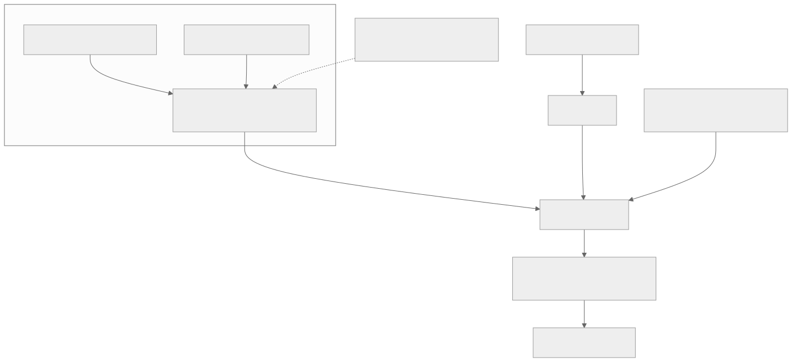

# 设备所有权与共享

## 目标与准备工作

为组织持有或消费者持有的设备选择正确的生命周期流程。请按照[云与设备配置](setup-cloud-device.zh-CN.md)准备已授权的测试账号、设备注册 ID 与运行时 `devid`。不要从证书文件名、MQTT 主题或登录成功推断所有权。

## 架构与职责范围



[查看完整架构图](assets/identity-access.zh-CN.svg) · [Mermaid 源码](assets/identity-access.zh-CN.mmd)


## 三种不同层次的归属

| 概念 | 决定的内容 |
| --- | --- |
| 出厂身份 | 设备证书、不可更改的生产信息与规范定义的服务使用权 |
| 账号绑定 | 哪个组织或用户可以管理或操作设备 |
| 设备主连接（owner transport） | 由哪个活跃运行时会话接收设备命令；参阅[在线状态与生命周期](device-presence.zh-CN.md) |

控制台用户、消费者 APP 终端用户与设备证书，代表不同的验证主体。组织认领使用 `POST /v1/orgs/{orgId}/devices/claim/resolve`；消费者 APP 认领使用 `POST /v1/app/devices/claim/resolve`，并以 APP 终端用户的 Bearer 令牌创建终端用户绑定。不可用控制台登录令牌代替 APP 身份。两者都使用入门流程所述的认领请求格式；设备激活须另行完成。

## 共享必须通过授权

开发者协作应使用获准的 Cloud／Product 成员资格与访问范围流程。将证书、令牌文件或 Claim Token 交给别人，不是共享授权。Cloud 所有权转移、Product 所有权转移与设备认领转移是不同操作。

已审查的公开规范未定义通用的消费者设备邀请或共享 API。不要自行假设有 `/devices/{id}/share`，不要假设组织成员资格会创建消费者绑定，也不要将所有者的凭证复制给其他用户。如果产品需要家庭共享功能，应先向服务负责团队确认支持的绑定与权限规范。

对任何支持的授权方式，都须确认被授权者只能访问指定设备并执行允许的操作。移除授权时，要同时测试已有连接与新的凭证请求。本版尚未验证通用的即时吊销或断开连接延迟保证。

## 解除普通设备绑定以供转售

[打开解除所有权绑定时序图](assets/ownership-release.zh-CN.html)

仅在当前所有者确实要释放设备所有权时，才使用 unprovision。此命令会变更所有权，只能在明确选定、可丢弃的测试设备上执行。它使用 Account Manager 令牌，不是 Video Cloud 运行时令牌。

```bash
curl --fail-with-body --silent --show-error --cacert "$CA_FILE"   -H "Authorization: Bearer $(jq -er '.tokens.access_token' "$TUTORIAL_DIR/account-login.json")"   -X POST "$ACCOUNT_BASE/v1/orgs/$ORG_ID/devices/$REGISTRY_DEVICE_ID/unprovision"   > "$TUTORIAL_DIR/unprovision-result.json"
jq -e '.unprovision.status == "unprovisioned"' "$TUTORIAL_DIR/unprovision-result.json"
```

HTTP 200 表示账号侧绑定已解除。响应的 `unprovision` 中包含 `device_id`、`organization_id`、`video_cloud_devid`、`status`，以及 RFC 3339 格式的 `unprovisioned_at`。跨服务清理以异步方式执行；此响应不能证明所有缓存会话都已停止。按规范，原用户必须失去组织范围内的列出、查看与控制权限。请另外验证已有 MQTT 与 HTTP 访问，并报告任何未落实的限制。

下一位所有者必须提供新的持有证明，完成认领解析并重新预配。出厂身份、证书与规范定义的服务选项会保留。这不代表可以将旧所有者的运行时令牌交给买家。

## 选择正确的破坏性操作

| 操作 | 预期结果 | 不代表 |
| --- | --- | --- |
| Unprovision | 解除当前账号绑定，以供转售或重新配置 | 吊销出厂身份、清除云端数据或重置硬件 |
| Deactivate | 因安全或下线需求，阻止或移除云端服务访问权限 | 设备会自动开放给其他所有者 |
| Soft-disable | 禁用账号侧的设备注册或访问记录 | 已解除所有权，或实体设备已退役 |
| Factory reset | 按产品定义重置设备本地状态 | 已解除云端所有权 |
| Admin claim transfer | 由支持人员授权，将认领转移至另一组织 | 普通客户具备自助转移权限 |

`POST /v1/admin/device-claims/{claimId}/transfer` 是平台管理员介入的操作，必须提供明确理由与证据。它只能转移尚未开始 Video Cloud 激活流程的认领。开始激活后，跨组织转移会返回 `409 cloud_lifecycle_bound`；此 API 不会迁移运行时会话或媒体，也不是普通客户转售 API。支持流程不得泄露原始认领资料或私钥。数据清除，以及保留的 Shadow／媒体如何处理，都须由产品策略明确定义；unprovision 不保证删除所有数据。

## 失败检查与验收

收到 401 时，请在正确的身份系统重新验证。收到 403 时，检查有效成员资格、目标所有权与 unprovision 权限。收到 409 时，应解决生命周期冲突，不要改用管理员端点。如果请求超时而结果不确定，重复变更前，先通过已授权的管理流程检查当前绑定。

请测试原用户访问被拒绝、新所有者认领、出厂身份保留，以及异步清理失败与恢复。不要用生产设备测试所有权转移。下一步：[凭证恢复](credential-recovery.zh-CN.md)、[集成测试工具包](integration-test-kit.zh-CN.md)。
