# 裝置所有權與分享

## 目標和先決條件

為組織擁有的或消費者裝置選擇正確的生命週期。準備一個授權的測試帳戶、登入檔裝置ID和執行時`devid`使用[雲/裝置設定](setup-cloud-device.zh-TW.md).切勿從證書檔名、MQTT主題或成功登入中推斷所有權。

## 架構和責任界限



[全尺寸方塊圖](assets/identity-access.zh-TW.svg) · [Mermaid 原始檔](assets/identity-access.zh-TW.mmd)


## 三種不同的所有權

|概念|它控制什麼|
| --- | --- |
|工廠身份|裝置證書、不可變的生產上下文和規範服務權利|
|帳戶繫結|哪些組織/使用者可以管理或操作該裝置|
|車主運輸|哪個活躍的執行時會話接收裝置命令；請參閱[存在和生命週期](device-presence.zh-TW.md) |

控制檯使用者、消費者APP終端使用者和裝置證書是不同的主體。組織索賠使用`POST /v1/orgs/{orgId}/devices/claim/resolve`. 消費者APP索賠使用`POST /v1/app/devices/claim/resolve`使用APP終端使用者承載者並建立終端使用者繫結。不要用控制檯登入令牌代替APP身份。兩者都使用入職中解釋的索賠請求形狀；啟動是一個單獨的步驟。

## 分享是一種授權決定

使用已批准的雲/產品會員資格和訪問範圍工作流程進行開發人員協作。給某人發放證書、令牌檔案或索取令牌並非分享。雲所有權轉讓、產品所有權轉讓和裝置索取轉讓是不同的操作。

審查的公共契約沒有建立一個通用消費者裝置邀請/共享API。不要發明`/devices/{id}/share`，假設組織會員資格會建立消費者繫結，或將所有者的憑據複製到另一個使用者。需要家庭共享的產品必須首先與服務所有者確認其支援的繫結/許可契約。

對於任何受支援的贈款，請驗證收件人只能訪問預期的裝置和操作，並用現有連線和新的憑據請求測試刪除。本版本不符合通用即時撤銷/斷開連線延遲的條件。

## 釋出一個正常裝置以進行轉售

[開啟重新設計的序列圖](assets/ownership-release.zh-TW.html)

只有當當前所有者打算釋放裝置時才使用未配置。此命令更改所有權；僅在明確選擇的一次性測試裝置上執行。它使用帳戶管理器令牌，而不是影片雲執行時令牌。

```bash
curl --fail-with-body --silent --show-error --cacert "$CA_FILE"   -H "Authorization: Bearer $(jq -er '.tokens.access_token' "$TUTORIAL_DIR/account-login.json")"   -X POST "$ACCOUNT_BASE/v1/orgs/$ORG_ID/devices/$REGISTRY_DEVICE_ID/unprovision"   > "$TUTORIAL_DIR/unprovision-result.json"
jq -e '.unprovision.status == "unprovisioned"' "$TUTORIAL_DIR/unprovision-result.json"
```

HTTP 200確認了帳戶側的繫結釋放。響應包括`device_id`, `organization_id`, `video_cloud_devid`, `status`和RFC 3339`unprovisioned_at`裡面`unprovision`.跨服務清理是非同步執行的；響應並不能證明每個快取會話都已經停止。根據契約，之前的使用者必須失去組織範圍的列表/檢視/控制權。單獨評估現有的MQTT和HTTP訪問資格，並報告任何執法差距。

下一個所有者必須提供新的所有權證明，解決索賠並再次提供。工廠身份、證書和標準服務選項保持完整。這並不允許將舊所有者的執行緒令牌轉讓給買家。

## 選擇正確的破壞操作

|操作|預期結果|不要假設|
| --- | --- | --- |
|未規劃|釋放當前賬戶的轉售/重新登記繫結|工廠身份被撤銷、雲有效載荷被抹除或硬體重置|
|停用|為了安全或拆解，封鎖/移除雲服務訪問許可權|自動可用於另一個所有者|
|軟禁用|停用帳戶登入檔/訪問記錄|所有權釋放或物理裝置停用|
|出廠重置|裝置本地產品行為|雲所有權釋出|
|管理員索賠轉讓|支援授權轉移到另一個組織|普通客戶自助服務許可|

`POST /v1/admin/device-claims/{claimId}/transfer`是一個需要明確理由和證據的平臺管理員覆蓋。它只移動尚未啟動影片雲啟動的索賠。啟動後的跨組織移動將返回`409 cloud_lifecycle_bound`；它不會遷移執行時會話或媒體。這不是正常的客戶轉售API。支援流程不得暴露原始索賠材料或私鑰。資料抹除和保留的影子/媒體處理需要明確的產品政策；未配置不是對資料刪除的全面保證。

## 故障檢查和接受

在401中，在正確的身份系統中重新驗證身份。在403中，檢查活動會員資格、目標所有權和未配置許可權。在409中，解決生命週期衝突，而不是切換到管理端點。在不確定的超時後，在重複變更之前，透過授權的管理工作流程檢查當前的繫結。

測試舊使用者拒絕、下一個所有者索賠、保留工廠身份、非同步清理失敗和恢復。不要使用生產裝置測試所有權轉讓。下一個：[憑證恢復](credential-recovery.zh-TW.md), [整合測試工具組](integration-test-kit.zh-TW.md).
