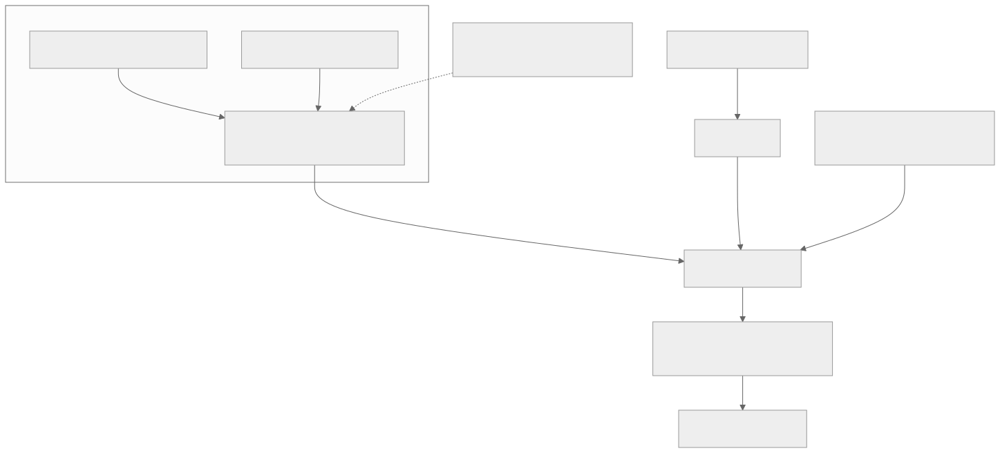

# 裝置所有權與分享

## 目標與事前準備

為組織持有或消費者持有的裝置選擇正確的生命週期流程。請依[雲端與裝置設定](setup-cloud-device.zh-TW.md)準備已授權的測試帳號、裝置註冊 ID 與執行階段 `devid`。不要從憑證檔名、MQTT 主題或登入成功推斷所有權。

## 架構與責任範圍



[檢視完整架構圖](assets/identity-access.zh-TW.svg) · [Mermaid 原始碼](assets/identity-access.zh-TW.mmd)


## 三種不同層次的歸屬

| 概念 | 決定的內容 |
| --- | --- |
| 出廠身分 | 裝置憑證、不可變更的生產資訊與正式服務使用權 |
| 帳號綁定 | 哪個組織或使用者可以管理或操作裝置 |
| 裝置主連線（owner transport） | 由哪個使用中的執行階段工作階段接收裝置命令；參閱[線上狀態與生命週期](device-presence.zh-TW.md) |

控制台使用者、消費者 APP 終端使用者與裝置憑證，代表不同的驗證主體。組織認領使用 `POST /v1/orgs/{orgId}/devices/claim/resolve`；消費者 APP 認領使用 `POST /v1/app/devices/claim/resolve`，並以 APP 終端使用者的 Bearer token 建立終端使用者綁定。不可用控制台登入 token 代替 APP 身分。兩者都使用入門流程所述的認領請求格式；裝置啟用須另行完成。

## 分享必須透過授權

開發者協作應使用核准的 Cloud／Product 成員資格與存取範圍流程。將憑證、token 檔案或 Claim Token 交給別人，不是分享授權。Cloud 所有權移轉、Product 所有權移轉與裝置認領移轉是不同操作。

已審查的公開規格未定義通用的消費者裝置邀請或分享 API。不要自行假設有 `/devices/{id}/share`，不要假設組織成員資格會建立消費者綁定，也不要將擁有者的驗證資訊複製給其他使用者。若產品需要家庭分享功能，應先向服務負責團隊確認支援的綁定與權限規格。

對任何支援的授權方式，都須確認接受授權者只能存取指定裝置並執行允許的操作。移除授權時，要同時測試既有連線與新的驗證資訊請求。本版尚未驗證共通的即時撤銷或斷線延遲保證。

## 解除一般裝置綁定以供轉售

[開啟解除所有權綁定時序圖](assets/ownership-release.zh-TW.html)

只有目前擁有者確實要放棄裝置所有權時，才使用 unprovision。此指令會變更所有權，只能在明確選定、可捨棄的測試裝置上執行。它使用 Account Manager token，不是 Video Cloud 執行階段 token。

```bash
curl --fail-with-body --silent --show-error --cacert "$CA_FILE"   -H "Authorization: Bearer $(jq -er '.tokens.access_token' "$TUTORIAL_DIR/account-login.json")"   -X POST "$ACCOUNT_BASE/v1/orgs/$ORG_ID/devices/$REGISTRY_DEVICE_ID/unprovision"   > "$TUTORIAL_DIR/unprovision-result.json"
jq -e '.unprovision.status == "unprovisioned"' "$TUTORIAL_DIR/unprovision-result.json"
```

HTTP 200 表示帳號端綁定已解除。回應的 `unprovision` 中包含 `device_id`、`organization_id`、`video_cloud_devid`、`status`，以及 RFC 3339 格式的 `unprovisioned_at`。跨服務清理以非同步方式執行；此回應不能證明所有快取工作階段都已停止。依規格，原使用者必須失去組織範圍內的列出、檢視與控制權。請另外驗證既有 MQTT 與 HTTP 存取，並回報任何未落實的限制。

下一位擁有者必須提供新的持有證明，完成認領解析並重新佈建。出廠身分、憑證與正式服務選項會保留。這不代表可以將舊擁有者的執行階段 token 交給買家。

## 選擇正確的破壞性操作

| 操作 | 預期結果 | 不代表 |
| --- | --- | --- |
| Unprovision | 解除目前帳號綁定，以供轉售或重新設定 | 撤銷出廠身分、清除雲端資料或重設硬體 |
| Deactivate | 因安全或停用需求，阻擋或移除雲端服務存取權 | 裝置會自動開放給其他擁有者 |
| Soft-disable | 停用帳號端的裝置註冊或存取記錄 | 已解除所有權，或實體裝置已除役 |
| Factory reset | 依產品定義重設裝置本機狀態 | 已解除雲端所有權 |
| Admin claim transfer | 由支援人員授權，將認領移轉至另一組織 | 一般客戶具備自助移轉權限 |

`POST /v1/admin/device-claims/{claimId}/transfer` 是平台管理員介入的操作，必須提供明確理由與證據。它只能移轉尚未開始 Video Cloud 啟用流程的認領。開始啟用後，跨組織移轉會回傳 `409 cloud_lifecycle_bound`；此 API 不會遷移執行階段工作階段或媒體，也不是一般客戶轉售 API。支援流程不得洩露原始認領資料或私鑰。資料清除，以及保留的 Shadow／媒體如何處理，都須由產品政策明確定義；unprovision 不保證刪除所有資料。

## 失敗檢查與驗收

收到 401 時，請在正確的身分系統重新驗證。收到 403 時，檢查有效成員資格、目標所有權與 unprovision 權限。收到 409 時，應解決生命週期衝突，不要改用管理員端點。若請求逾時而結果不確定，重複變更前，先透過已授權的管理流程檢查目前綁定。

請測試原使用者存取遭拒、新擁有者認領、出廠身分保留，以及非同步清理失敗與復原。不要用正式裝置測試所有權移轉。下一步：[驗證資訊復原](credential-recovery.zh-TW.md)、[整合測試工具組](integration-test-kit.zh-TW.md)。
