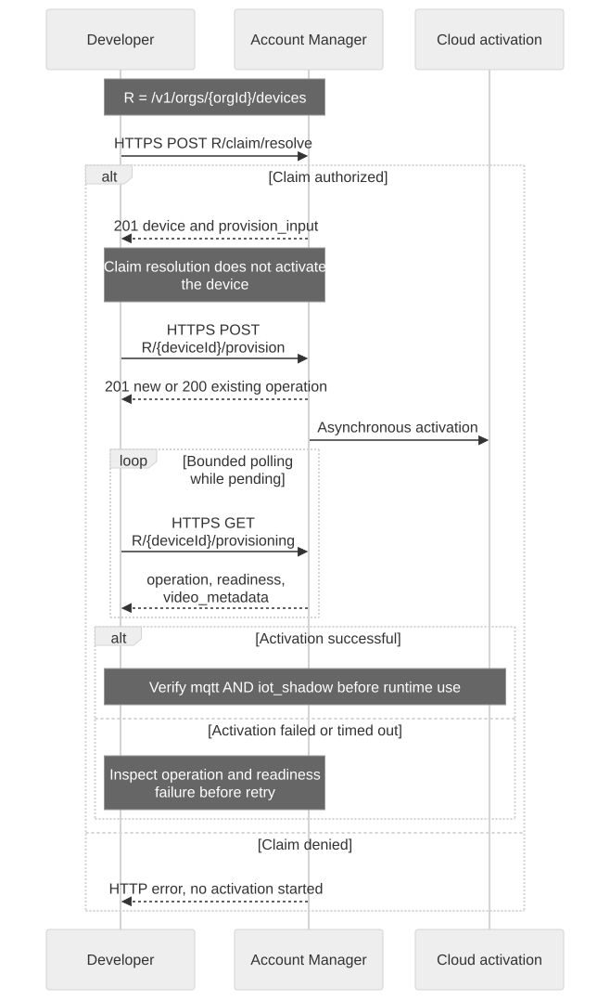

# Set Up Your First Cloud and Device

## Goal and prerequisites

Finish with one enabled registry device, its mapped cloud `devid`, a successful provisioning result, and an authorized application user. Use a dedicated test device with factory identity and valid Claim Token, a verified account, and permission to manage the target Cloud/Product. Obtain the Account Manager public HTTPS origin and CA bundle from your environment's connection handoff.



[Open full-size diagram](assets/first-device.svg) · [Mermaid source](assets/first-device.mmd)

## 1. Create or select a Brand Cloud and Product

1. Sign in to Connect+ and open **My Clouds**. Select the intended Cloud or use **Create Brand Cloud** if your account is allowed to create one. Complete owner activation before managing it.
2. Inside that Cloud, open **Products → Add Product**. Enter **Product Name**, **Product Model**, and the category appropriate to your device. A category is registry taxonomy, not a credential scope.
3. Select **Device Telemetry**, which maps to `mqtt`, and save the Product.
4. Arrange `iot_shadow` in the approved Product/device service configuration with your project operator. **The current Product editor has no separate Shadow checkbox.** Selecting Device Telemetry does not enable Shadow. The canonical provisioning API accepts `iot_shadow`, but entitlement and policy still govern acceptance.
5. Use **Members & Access** and the appropriate Product scope to authorize the developer. A visible Product or a successful login alone does not prove runtime device access. Consumer APP end-user bindings are a separate identity flow; do not assume a console membership is an APP end-user binding.

For existing Products, preview the impact of service changes and verify any required reprovisioning has completed. Do not edit a token or enlarge a claim response's service list to work around a missing entitlement.

## 2. Keep the identifiers separate

| Identifier | Use |
| --- | --- |
| Brand Cloud / organization ID | Account Manager organization context; use the ID returned for the selected Cloud, never a display name |
| Product / device item profile ID | Product authorization and device configuration |
| Registry `device.id` | Account Manager device routes |
| `provision_input.video_cloud_devid` | Runtime token `devid`, MQTT topics and Shadow `thingName` |
| Claim Token | Possession proof supplied with the device; not a login or runtime token |

## 3. Resolve the claim through Account Manager

The following is the organization-owned developer integration path, not the separate consumer APP claim API. Complete account login as described in [Credential Setup](credential-setup.en.md), then retain the login response as `$TUTORIAL_DIR/account-login.json`.

```bash
export ACCOUNT_BASE='https://accounts.example.test'
export ORG_ID='replace-with-selected-cloud-organization-id'
read -r -s -p 'Device Claim Token: ' CLAIM_TOKEN; printf '\n'
jq -n --arg claim "$CLAIM_TOKEN" \
  '{claim_token:$claim,device_name:"Developer test device"}' > "$TUTORIAL_DIR/claim-request.json"
unset CLAIM_TOKEN
curl --fail-with-body --silent --show-error --cacert "$CA_FILE" \
  -H "Authorization: Bearer $(jq -er '.tokens.access_token' "$TUTORIAL_DIR/account-login.json")" \
  -H 'Content-Type: application/json' --data-binary @"$TUTORIAL_DIR/claim-request.json" \
  "$ACCOUNT_BASE/v1/orgs/$ORG_ID/devices/claim/resolve" > "$TUTORIAL_DIR/claim.json"
export REGISTRY_DEVICE_ID="$(jq -er '.device.id' "$TUTORIAL_DIR/claim.json")"
export DEVICE_ID="$(jq -er '.provision_input.video_cloud_devid' "$TUTORIAL_DIR/claim.json")"
```

Expect HTTP 201 with `claim_id`, `device`, and `provision_input`. Claim resolution creates/locates the registry binding; it does **not** start activation. Preserve `activity_id`, `clip_public_key`, and the approved service list returned in `provision_input`; do not fabricate them even for a Shadow-only exercise.

## 4. Start provisioning and read its outcome

```bash
jq -e '.provision_input | .service_options | index("mqtt") != null and index("iot_shadow") != null' \
  "$TUTORIAL_DIR/claim.json"
# Continue only if both required capabilities are present.
jq '.provision_input' "$TUTORIAL_DIR/claim.json" > "$TUTORIAL_DIR/provision-request.json"
curl --fail-with-body --silent --show-error --cacert "$CA_FILE" \
  -H "Authorization: Bearer $(jq -er '.tokens.access_token' "$TUTORIAL_DIR/account-login.json")" \
  -H 'Content-Type: application/json' --data-binary @"$TUTORIAL_DIR/provision-request.json" \
  "$ACCOUNT_BASE/v1/orgs/$ORG_ID/devices/$REGISTRY_DEVICE_ID/provision" \
  > "$TUTORIAL_DIR/provision-result.json"
curl --fail-with-body --silent --show-error --cacert "$CA_FILE" \
  -H "Authorization: Bearer $(jq -er '.tokens.access_token' "$TUTORIAL_DIR/account-login.json")" \
  "$ACCOUNT_BASE/v1/orgs/$ORG_ID/devices/$REGISTRY_DEVICE_ID/provisioning" \
  > "$TUTORIAL_DIR/provisioning-state.json"
```

A 201 creates an operation; a 200 can return an existing operation. Neither alone proves activation completed. Read the provisioning state again with bounded polling while work is pending. Inspect `operation.status`, `readiness.state`, `readiness.sources`, and `video_metadata`; inspect `readiness.failure` when present; stop on a terminal failure and record its operation ID. Retain the same operation identity when retrying an uncertain request rather than starting unrelated duplicate operations.

## 5. Ready check and failure recovery

- Confirm the registry device is enabled and mapped to the expected `DEVICE_ID`.
- Confirm provisioning succeeded and the device is activated with both capabilities.
- Confirm the certificate identity matches that `DEVICE_ID` and the app user is authorized for it.
- Issue separate app/device tokens, then verify CONNECT, SUBACK and a Shadow GET independently. A fresh Shadow GET may correctly return 404.
- An MQTT tutorial connection does not implement the service's owner-transport protocol or prove the Fleet online indicator should change.

For an invalid/already claimed token, use the claim resolution/transfer policy; repeatedly calling provisioning will not repair ownership. For 403, verify Cloud, Product scope and device binding. For a pending activation, inspect the operation instead of replacing device credentials. If `iot_shadow` is absent, return to the Product/entitlement setup step.

Next: [Device and App Credential Setup](credential-setup.en.md), then [the two-principal example](app-device-example.en.md).

Continue: [Ownership and release lifecycle](ownership-sharing.en.md).

Architecture: [Account, factory and runtime lifecycle layers](device-presence.en.md).
