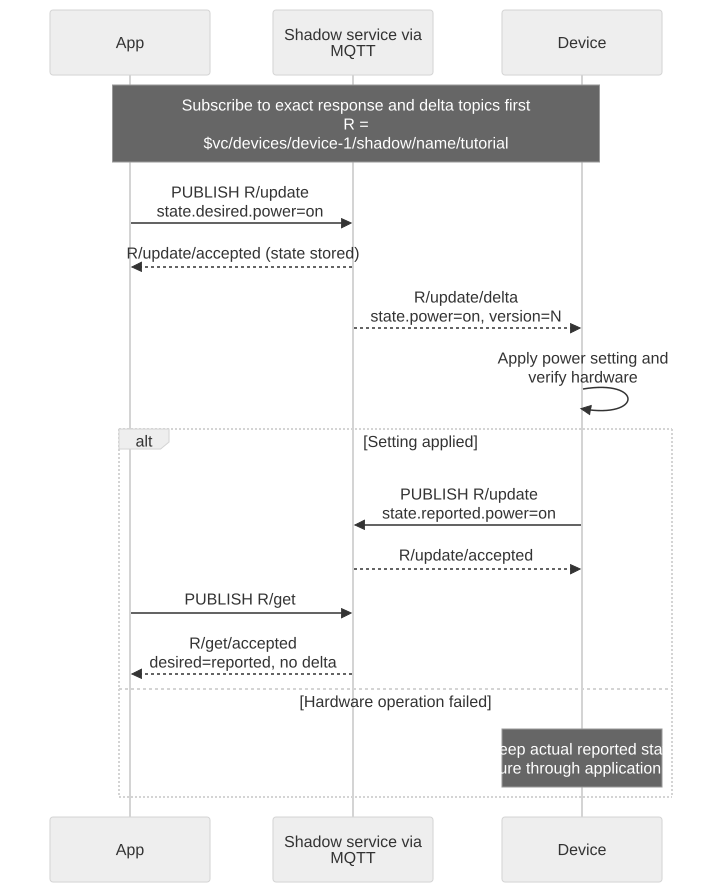

# Device Shadow Concepts

A Shadow is a stored JSON state document, not a connection or a queue of commands. A device can disconnect while the requested state remains available for later reconciliation.

[Open full-size diagram](assets/shadow-sync.svg) · [Mermaid source](assets/shadow-sync.mmd)

## Inside a Shadow document

Desired is intent, reported is observation, and delta is a service-computed difference. Metadata and versions belong to the service. The client roles shown are typical application responsibilities, not an automatic desired-only/reported-only permission rule. Delta is derived rather than an independently writable field.

[Full-size block diagram](assets/shadow-document-model.svg) · [Mermaid source](assets/shadow-document-model.mmd)

## State fields

- `desired`: the state an application wants.
- `reported`: the actual state reported by the device.
- `delta`: desired properties that differ from reported state; calculated by the service.
- `metadata`: service-authored timestamps mirroring state properties.
- `version`: the document's increasing mutation version.
- `timestamp`: a service-authored epoch timestamp.

For desired `power:"on"` and reported `power:"off"`, the delta contains `power:"on"`. After firmware applies the change and reports `power:"on"`, that difference disappears. A converged document omits an empty delta; do not require `delta:{}` or a special empty-delta event.

## Names and lifecycle

Each device can have an unnamed Shadow and independently versioned named Shadows. Omit the HTTP `name` query parameter, or omit `/name/{shadowName}` in MQTT, to select the unnamed Shadow. This guide uses named Shadow `tutorial`.

Device activation does not create a Shadow. GET for a missing Shadow returns 404. The first valid UPDATE creates it. Deleting and recreating a Shadow within 48 hours continues its version sequence. After that tombstone window expires, recreation restarts initial-version behavior; applications must account for a new lifecycle rather than permanently rejecting lower versions.

## Patches and conflicts

Updates recursively merge objects. `null` deletes a property; `desired:null` or `reported:null` removes that section. Arrays replace atomically and cannot contain null elements. A patch's optional `version` must match current state or the request fails with 409.

UPDATE accepted contains the accepted patch, not a complete replacement snapshot. Use GET for current full state or the `update/documents` notification for previous/current snapshots.

Notifications may repeat. Track version and event type, and correlate request responses separately: an accepted message must not cause you to discard a same-version delta before processing it. See [integration recipes](integration-recipes.en.md).

Next: [synchronize your first state](shadow-quickstart.en.md).

Continue: [Design your device state model](state-model.en.md).
