# 装置影子概念

影子是一个储存的JSON状态档案，而不是连线或命令伫列。装置可以在请求的状态仍然可用以进行后续协调时断开连线。

[开启重新设计的序列图](assets/shadow-sync.zh-CN.html)

## 在Shadow档案中

期望值是意图，报告值是观察值，而差异值是服务计算的差异值。元资料和版本属于服务。显示的客户端角色是典型的应用程式职责，而不是自动的仅期望值/仅报告值许可规则。差异值是汇出的，而不是独立可写的栏位。

[全尺寸方块图](assets/shadow-document-model.zh-CN.svg) · [Mermaid 原始档](assets/shadow-document-model.zh-CN.mmd)

## 状态列位

- `desired`：应用程式想要的状态。
- `reported`：装置报告的实际状态。
- `delta`：与报告状态不同的所需属性；由服务计算。
- `metadata`：服务编写的时间戳映象状态属性。
- `version`：档案的变异版本越来越多。
- `timestamp`：服务编写的时代时间戳。

为了想要的`power:"on"`并报告了`power:"off"`，三角洲包含`power:"on"`。在韧体应用更改并报告后`power:"on"`，这种差异消失了。收敛的档案省略了一个空的三角形；不需要`delta:{}`或一个特殊的空三角形事件。

## 名称和生命周期

每个装置都可以有一个无名影子和独立版本的命名影子。省略HTTP`name`查询引数，或省略`/name/{shadowName}`在MQTT中，要选择无名影子。本指南使用有名的影子`tutorial`.

装置启动不会建立影子。对于丢失的影子，GET返回404。第一次有效的UPDATE建立它。在48小时内删除和重新建立影子会继续其版本序列。在那之后，墓碑视窗过期后，重新建立会重新启动初始版本的行为；应用程式必须考虑新的生命周期，而不是永久拒绝较低版本。

## 补丁程式和冲突

更新可迭代地合并物件。`null`删除一个属性；`desired:null`或者`reported:null`删除该部分。阵列原子替换，不能包含空元素。补丁程式的可选`version`必须与当前状态匹配，否则请求将以409失败。

接受的更新包含接受的补丁程式，而不是完整的替换快照。使用GET获取当前的完整状态或`update/documents`以前/当前快照的通知。

通知可能会重复发出。跟踪版本和事件型别，并单独对应请求响应：接受的讯息在处理之前不得导致您丢弃相同版本的差异。 看到[整合食谱](integration-recipes.zh-CN.md).

下一个：[同步您的第一个状态](shadow-quickstart.zh-CN.md).

继续：[设计您的装置状态模型](state-model.zh-CN.md).
