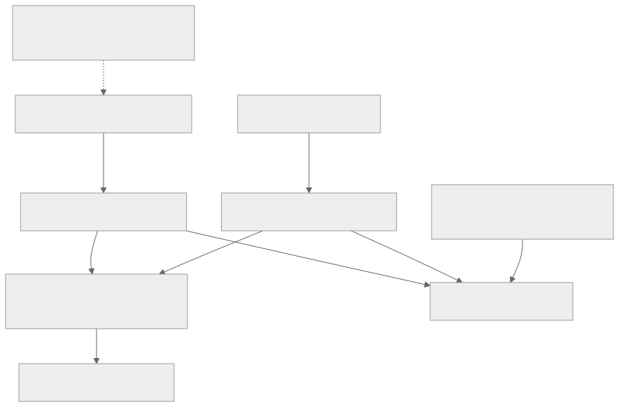

# 设备影子概念

设备影子（Device Shadow）是存储在云端的 JSON 状态文档。它不代表连接，也不是命令队列。设备离线时，期望状态仍会保留，供设备重新连接后读取并同步。

[开启时序图](assets/shadow-sync.zh-CN.html)

## 影子文档的组成

desired 表示期望状态，reported 表示设备上报状态，delta 则是服务计算出的状态差异。元数据与版本由服务管理。图中的客户端分工是常见的应用设计，并不表示系统会自动限制各方只能写入 desired 或 reported。delta 是衍生数据，不能独立写入。

[开启完整框图](assets/shadow-document-model.zh-CN.svg) · [Mermaid 源文件](assets/shadow-document-model.zh-CN.mmd)

## 状态字段

- `desired`：应用程序希望设备达到的期望状态。
- `reported`：设备上报的实际状态。
- `delta`：desired 中与 reported 不同的属性，由服务计算。
- `metadata`：服务产生的属性时间戳，结构对应各状态属性。
- `version`：文件每次异动时递增的版本。
- `timestamp`：服务产生的 Unix 时间戳。

例如，desired 为 `power:"on"`、reported 为 `power:"off"` 时，delta 会包含 `power:"on"`。固件完成操作并上报 `power:"on"` 后，这项差异就会消失。状态一致时，文档会省略空的 delta；不要要求一定收到 `delta:{}` 或专门表示 delta 为空的事件。

## 名称与生命周期

每个设备可以有一个未命名影子，以及多个各自管理版本的命名影子。在 HTTP 中省略 `name` 查询参数，或在 MQTT 主题中省略 `/name/{shadowName}`，即可选择未命名影子。本教学使用名为 `tutorial` 的命名影子。

启用设备不会自动创建影子。读取尚不存在的影子时，GET 会返回 404；第一次有效的 UPDATE 才会创建它。删除影子后若在 48 小时内重建，版本编号会延续先前的序列。这段删除记录保留期结束后，重建时会重新采用初始版本规则；应用程序必须识别新的生命周期，不能永久拒绝较小的版本号。

## 部分更新与版本冲突

更新会递归合并 JSON 对象。`null` 会删除属性；`desired:null` 或 `reported:null` 会删除整个区段。数组以原子方式整体替换，且不得包含 null 元素。部分更新（patch）可选 `version`；若有提供，必须符合当前版本，否则请求会以 409 失败。

UPDATE accepted 响应只包含接受的部分更新，不是完整状态快照。若需要当前完整状态，请使用 GET；若需要更新前后的快照，请读取 `update/documents` 通知。

通知可能重复送达。请分别跟踪版本、事件类型及请求与响应的对应关系：收到 accepted 后，不可因此丢弃尚未处理的同版本 delta。详见[集成实现示例](integration-recipes.zh-CN.md)。

下一步：[同步第一个设备状态](shadow-quickstart.zh-CN.md)。

延伸阅读：[设计设备状态模型](state-model.zh-CN.md)。
