# 裝置影子概念

影子是一個儲存的JSON狀態檔案，而不是連線或命令佇列。裝置可以在請求的狀態仍然可用以進行後續協調時斷開連線。

[開啟重新設計的序列圖](assets/shadow-sync.zh-TW.html)

## 在Shadow檔案中

期望值是意圖，報告值是觀察值，而差異值是服務計算的差異值。元資料和版本屬於服務。顯示的客戶端角色是典型的應用程式職責，而不是自動的僅期望值/僅報告值許可規則。差異值是匯出的，而不是獨立可寫的欄位。

[全尺寸方塊圖](assets/shadow-document-model.zh-TW.svg) · [Mermaid 原始檔](assets/shadow-document-model.zh-TW.mmd)

## 狀態列位

- `desired`：應用程式想要的狀態。
- `reported`：裝置報告的實際狀態。
- `delta`：與報告狀態不同的所需屬性；由服務計算。
- `metadata`：服務編寫的時間戳映象狀態屬性。
- `version`：檔案的變異版本越來越多。
- `timestamp`：服務編寫的時代時間戳。

為了想要的`power:"on"`並報告了`power:"off"`，三角洲包含`power:"on"`。在韌體應用更改並報告後`power:"on"`，這種差異消失了。收斂的檔案省略了一個空的三角形；不需要`delta:{}`或一個特殊的空三角形事件。

## 名稱和生命週期

每個裝置都可以有一個無名影子和獨立版本的命名影子。省略HTTP`name`查詢引數，或省略`/name/{shadowName}`在MQTT中，要選擇無名影子。本指南使用有名的影子`tutorial`.

裝置啟動不會建立影子。對於丟失的影子，GET返回404。第一次有效的UPDATE建立它。在48小時內刪除和重新建立影子會繼續其版本序列。在那之後，墓碑視窗過期後，重新建立會重新啟動初始版本的行為；應用程式必須考慮新的生命週期，而不是永久拒絕較低版本。

## 補丁程式和衝突

更新可迭代地合併物件。`null`刪除一個屬性；`desired:null`或者`reported:null`刪除該部分。陣列原子替換，不能包含空元素。補丁程式的可選`version`必須與當前狀態匹配，否則請求將以409失敗。

接受的更新包含接受的補丁程式，而不是完整的替換快照。使用GET獲取當前的完整狀態或`update/documents`以前/當前快照的通知。

通知可能會重複發出。跟蹤版本和事件型別，並單獨對應請求響應：接受的訊息在處理之前不得導致您丟棄相同版本的差異。 看到[整合食譜](integration-recipes.zh-TW.md).

下一個：[同步您的第一個狀態](shadow-quickstart.zh-TW.md).

繼續：[設計您的裝置狀態模型](state-model.zh-TW.md).
