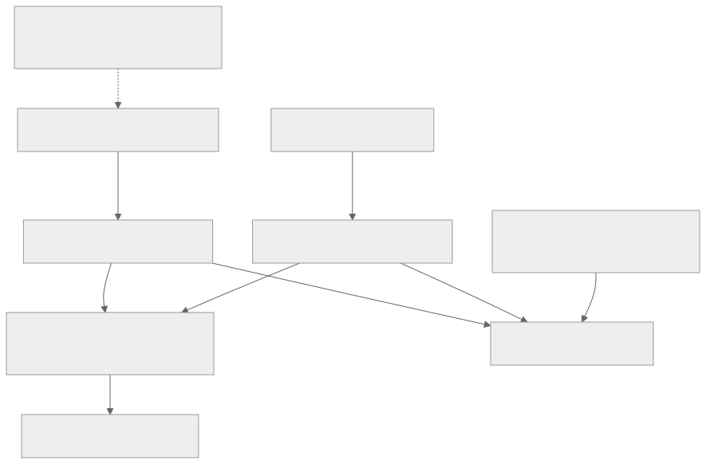

# 裝置影子概念

裝置影子（Device Shadow）是儲存在雲端的 JSON 狀態文件。它不代表連線，也不是命令佇列。裝置離線時，預期狀態仍會保留，供裝置重新連線後讀取並同步。

[開啟時序圖](assets/shadow-sync.zh-TW.html)

## 影子文件的組成

desired 表示預期狀態，reported 表示裝置回報狀態，delta 則是服務計算出的狀態差異。中繼資料與版本由服務管理。圖中的用戶端分工是常見的應用設計，並不表示系統會自動限制各方只能寫入 desired 或 reported。delta 是衍生資料，不能獨立寫入。

[開啟完整方塊圖](assets/shadow-document-model.zh-TW.svg) · [Mermaid 原始檔](assets/shadow-document-model.zh-TW.mmd)

## 狀態欄位

- `desired`：應用程式希望裝置達到的預期狀態。
- `reported`：裝置回報的實際狀態。
- `delta`：desired 中與 reported 不同的屬性，由服務計算。
- `metadata`：服務產生的屬性時間戳記，結構對應各狀態屬性。
- `version`：文件每次異動時遞增的版本。
- `timestamp`：服務產生的 Unix 時間戳記。

例如，desired 為 `power:"on"`、reported 為 `power:"off"` 時，delta 會包含 `power:"on"`。韌體完成操作並回報 `power:"on"` 後，這項差異就會消失。狀態一致時，文件會省略空的 delta；不要要求一定收到 `delta:{}` 或專門表示 delta 為空的事件。

## 名稱與生命週期

每個裝置可以有一個未命名影子，以及多個各自管理版本的具名影子。在 HTTP 中省略 `name` 查詢參數，或在 MQTT 主題中省略 `/name/{shadowName}`，即可選擇未命名影子。本教學使用名為 `tutorial` 的具名影子。

啟用裝置不會自動建立影子。讀取尚不存在的影子時，GET 會回傳 404；第一次有效的 UPDATE 才會建立它。刪除影子後若在 48 小時內重建，版本編號會延續先前的序列。這段刪除記錄保留期結束後，重建時會重新採用初始版本規則；應用程式必須識別新的生命週期，不能永久拒絕較小的版本號。

## 部分更新與版本衝突

更新會遞迴合併 JSON 物件。`null` 會刪除屬性；`desired:null` 或 `reported:null` 會刪除整個區段。陣列以原子方式整組取代，且不得包含 null 元素。部分更新（patch）可選填 `version`；若有提供，必須符合目前版本，否則請求會以 409 失敗。

UPDATE accepted 回應只包含接受的部分更新，不是完整狀態快照。若需要目前完整狀態，請使用 GET；若需要更新前後的快照，請讀取 `update/documents` 通知。

通知可能重複送達。請分別追蹤版本、事件類型及請求與回應的對應關係：收到 accepted 後，不可因此丟棄尚未處理的同版本 delta。詳見[整合實作範例](integration-recipes.zh-TW.md)。

下一步：[同步第一個裝置狀態](shadow-quickstart.zh-TW.md)。

延伸閱讀：[設計裝置狀態模型](state-model.zh-TW.md)。
