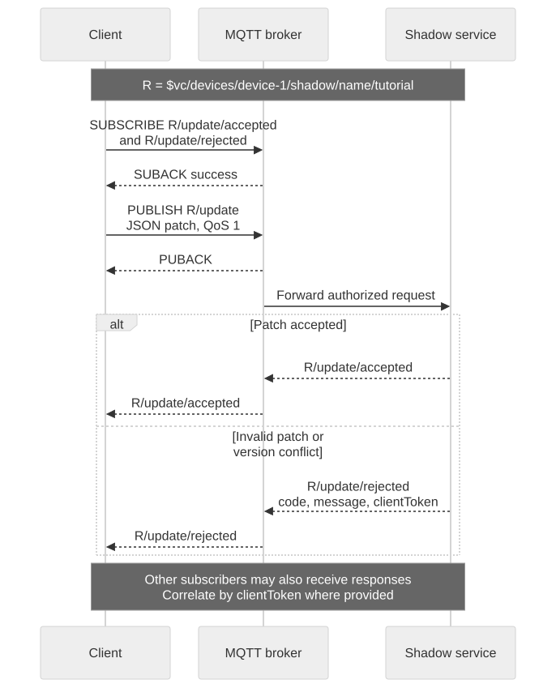
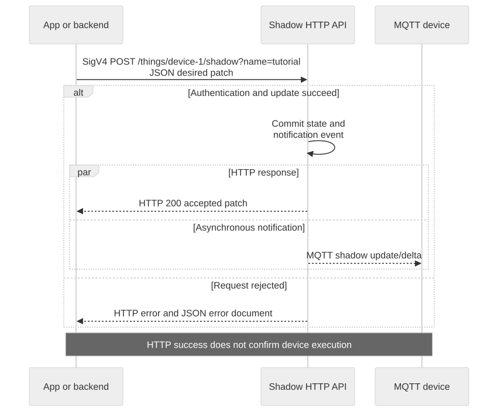

# Using Shadows over MQTT and HTTP

Use either interface against the same device and Shadow name. HTTP requires `iot_shadow`; MQTT requires both `mqtt` and `iot_shadow`. Authorization must also allow the principal, device, and operation.

## Two interfaces to the same state

MQTT and HTTP address the same device and Shadow name through distinct authentication and response paths. Their shared document semantics do not make MQTT acknowledgements equivalent to HTTP or Shadow success. Capability and principal checks still apply independently at each interface.



[Full-size block diagram](assets/shadow-interface-map.svg) · [Mermaid source](assets/shadow-interface-map.mmd)

## MQTT request and response



[Open full-size diagram](assets/shadow-mqtt-request.svg) · [Mermaid source](assets/shadow-mqtt-request.mmd)

Use the `shadow_publish` helper from [Shadow Quickstart](shadow-quickstart.en.md). Subscribe to the operation's exact accepted and rejected topics first. GET can carry a `clientToken` for correlation; UPDATE carries a JSON patch. DELETE ignores its payload and returns an empty accepted object, so do not depend on a delete `clientToken` echo.

For an explicit deletion of the test Shadow, first observe both delete response topics, then publish:

```bash
shadow_publish "$TUTORIAL_DIR/app-token.json" delete '{}'
```

GET afterwards should return 404. Serialize deletes for the same Shadow to avoid ambiguous responses. Full topic suffixes are in the [reference](shadow-reference.en.md).

## Signed HTTP requests



[Open full-size diagram](assets/shadow-http-request.svg) · [Mermaid source](assets/shadow-http-request.mmd)

The following Bash helper uses curl's SigV4 signer. Complete token issuance with `aws_iot_data:true` first. Credentials belong to RTK's custom endpoint; no AWS account credentials are needed.

```bash
export TOKEN_FILE="$TUTORIAL_DIR/app-token.json"
export SHADOW_ENDPOINT="$(jq -er '.aws_credentials.iotDataEndpoint' "$TOKEN_FILE")"
export SHADOW_REGION="$(jq -er '.aws_credentials.region' "$TOKEN_FILE")"
export SHADOW_ACCESS_KEY="$(jq -er '.aws_credentials.accessKeyId' "$TOKEN_FILE")"
export SHADOW_SECRET_KEY="$(jq -er '.aws_credentials.secretAccessKey' "$TOKEN_FILE")"
export SHADOW_SESSION_TOKEN="$(jq -er '.aws_credentials.sessionToken' "$TOKEN_FILE")"
shadow_http() {
  curl --silent --show-error --fail-with-body --cacert "$CA_FILE" \
    --aws-sigv4 "aws:amz:$SHADOW_REGION:iotdevicegateway" \
    --user "$SHADOW_ACCESS_KEY:$SHADOW_SECRET_KEY" \
    -H "x-amz-security-token: $SHADOW_SESSION_TOKEN" "$@"
}
ENCODED_DEVICE="$(jq -rn --arg v "$DEVICE_ID" '$v|@uri')"
ENCODED_NAME="$(jq -rn --arg v "$SHADOW_NAME" '$v|@uri')"
SHADOW_URL="${SHADOW_ENDPOINT%/}/things/$ENCODED_DEVICE/shadow?name=$ENCODED_NAME"
```

Use endpoint and region exactly as returned. Keep the machine clock synchronized. To use the unnamed Shadow, omit the complete `?name=...` query; `name=` is not the unnamed Shadow.

### Read and update

```bash
shadow_http "$SHADOW_URL"
shadow_http -X POST -H 'Content-Type: application/json' \
  --data-binary '{"state":{"desired":{"power":"on"}},"clientToken":"tutorial-http-on"}' \
  "$SHADOW_URL"
shadow_http "$SHADOW_URL"
```

If the initial GET returns 404, the POST creates the Shadow. Successful POST returns the accepted patch, while the final GET returns full current state. HTTP completion does not wait for MQTT delivery or device execution. Keep the MQTT observer from the Quickstart running to observe the cross-protocol notification.

### List named Shadows

```bash
shadow_http "${SHADOW_ENDPOINT%/}/api/things/shadow/ListNamedShadowsForThing/$ENCODED_DEVICE?pageSize=10"
```

Read `results`, optional `nextToken`, and `timestamp`. When `nextToken` is present, URL-encode it and send it unchanged in the next request with the same device. Do not decode or modify the cursor. The unnamed Shadow is not listed; a missing Thing returns an empty list.

### Delete tutorial state

Run only when finished with this test Shadow:

```bash
shadow_http -X DELETE "$SHADOW_URL"
shadow_http "$SHADOW_URL"
```

DELETE returns an empty JSON object on success; the following GET returns 404. GET and DELETE must not have request bodies. Recreating within 48 hours continues the prior version sequence.

## Failure handling

Read both HTTP status and error JSON; `--fail-with-body` preserves the error body while returning a nonzero exit status. For 401, check credentials, session token, clock, endpoint, and region. For 409, reconcile through a fresh GET rather than replaying a stale patch. Do not retry permanent 4xx errors without correcting the request.

Next: [complete reference](shadow-reference.en.md).
