# 透过 MQTT 与 HTTP 使用装置影子

使用任何一个介面对同一装置和影子名称。HTTP要求`iot_shadow`; MQTT需要这两个`mqtt`与`iot_shadow`。授权还必须允许主机、装置和操作。

## 两个介面通向同一个状态

MQTT和HTTP透过不同的身份验证和响应路径针对相同的装置和影子名称进行处理。它们共享的档案语义并不使MQTT确认等同于HTTP或影子成功。能力和主检查仍然在每个介面上独立适用。



[全尺寸方块图](assets/shadow-interface-map.zh-CN.svg) · [Mermaid 原始档](assets/shadow-interface-map.zh-CN.mmd)

## MQTT请求和响应

[开启重新设计的序列图](assets/shadow-mqtt-request.zh-CN.html)

使用`shadow_publish`来自的助手[影子快速入门](shadow-quickstart.zh-CN.md)。首先订阅操作的确切接受和拒绝主题。GET可以承担一个`clientToken`用于相关性；UPDATE带有JSON补丁。DELETE忽略其有效载荷，并返回一个空的接受物件，因此不要依赖于删除`clientToken`回声。

要明确删除测试影子，请先观察两种删除响应主题，然后释出：

```bash
shadow_publish "$TUTORIAL_DIR/app-token.json" delete '{}'
```

之后的GET应该返回404。为相同的影子序列化删除，以避免模棱两可的响应。完整的主题字尾在[参考](shadow-reference.zh-CN.md).

## 签名的HTTP请求

[开启重新设计的序列图](assets/shadow-http-request.zh-CN.html)

以下Bash助手使用curl的SigV4签名者。使用以下完成令牌发行`aws_iot_data:true`首先。凭据属于RTK的自定义端点；不需要AWS帐户凭据。

```bash
export TOKEN_FILE="$TUTORIAL_DIR/app-token.json"
export SHADOW_ENDPOINT="$(jq -er '.aws_credentials.iotDataEndpoint' "$TOKEN_FILE")"
export SHADOW_REGION="$(jq -er '.aws_credentials.region' "$TOKEN_FILE")"
export SHADOW_ACCESS_KEY="$(jq -er '.aws_credentials.accessKeyId' "$TOKEN_FILE")"
export SHADOW_SECRET_KEY="$(jq -er '.aws_credentials.secretAccessKey' "$TOKEN_FILE")"
export SHADOW_SESSION_TOKEN="$(jq -er '.aws_credentials.sessionToken' "$TOKEN_FILE")"
shadow_http() {
  curl --silent --show-error --fail-with-body --cacert "$CA_FILE" \
    --aws-sigv4 "aws:amz:$SHADOW_REGION:iotdevicegateway" \
    --user "$SHADOW_ACCESS_KEY:$SHADOW_SECRET_KEY" \
    -H "x-amz-security-token: $SHADOW_SESSION_TOKEN" "$@"
}
ENCODED_DEVICE="$(jq -rn --arg v "$DEVICE_ID" '$v|@uri')"
ENCODED_NAME="$(jq -rn --arg v "$SHADOW_NAME" '$v|@uri')"
SHADOW_URL="${SHADOW_ENDPOINT%/}/things/$ENCODED_DEVICE/shadow?name=$ENCODED_NAME"
```

请完全按照返回的内容使用端点和区域。保持机器时钟同步。要使用无名影子，请省略完整的`?name=...`查询；`name=`不是无名之影。

### 阅读和更新

```bash
shadow_http "$SHADOW_URL"
shadow_http -X POST -H 'Content-Type: application/json' \
  --data-binary '{"state":{"desired":{"power":"on"}},"clientToken":"tutorial-http-on"}' \
  "$SHADOW_URL"
shadow_http "$SHADOW_URL"
```

如果初始GET返回404，则POST建立影子。成功POST返回接受的补丁程式，而最终GET返回完整的当前状态。HTTP完成不会等待MQTT传输或装置执行。请保持快速入门中的MQTT观察器执行，以观察跨协议通知。

### 名为Shadows的列表

```bash
shadow_http "${SHADOW_ENDPOINT%/}/api/things/shadow/ListNamedShadowsForThing/$ENCODED_DEVICE?pageSize=10"
```

阅读`results`，可选的`nextToken`，和`timestamp`。 什么时候`nextToken`存在，将其URL编码，并在下一个使用相同装置的请求中保持不变地传送。不要解码或修改游标。未命名的影子未列出；缺失的东西会返回空列表。

### 删除教学状态

只有在完成此测试Shadow后才能执行：

```bash
shadow_http -X DELETE "$SHADOW_URL"
shadow_http "$SHADOW_URL"
```

成功时，DELETE返回一个空的JSON物件；以下GET返回404。GET和DELETE不得有请求身分。在48小时内重新建立将继续之前的版本序列。

## 故障处理

读取HTTP状态和错误JSON；`--fail-with-body`在返回非零的退出状态时保留错误内容。对于401，请检查凭据、会话令牌、时钟、端点和区域。对于409，请透过新的GET进行协调，而不是重复播放过时的补丁程式。在未更正请求的情况下，不要重试永久的4xx错误。

下一个：[完整的参考资料](shadow-reference.zh-CN.md).
