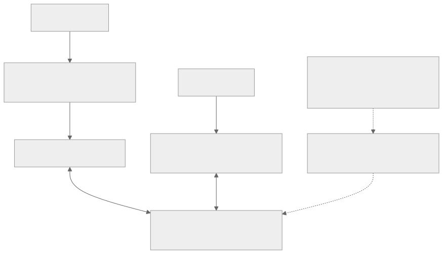

# 通过 MQTT 与 HTTP 操作设备影子

两种接口都可以操作同一设备、同一名称的影子。HTTP 需要启用 `iot_shadow`；MQTT 需要同时启用 `mqtt` 与 `iot_shadow`。授权规则也必须允许当前身份访问目标设备并执行该操作。

## 两种接口，共用同一份状态

MQTT 与 HTTP 通过不同的验证与响应流程，访问同一设备、同一名称的影子。虽然文档操作规则相同，MQTT 的传输确认并不等于 HTTP 或影子操作成功。两种接口仍各自检查服务功能是否启用，以及调用者是否有权限。



[开启完整框图](assets/shadow-interface-map.zh-CN.svg) · [Mermaid 源文件](assets/shadow-interface-map.zh-CN.mmd)

## MQTT 请求与响应

[开启时序图](assets/shadow-mqtt-request.zh-CN.html)

使用[设备状态同步快速入门](shadow-quickstart.zh-CN.md)中的 `shadow_publish` 辅助函数。请先订阅该操作完整且明确的 accepted 与 rejected 主题。GET 可附带 `clientToken` 来对应请求与响应；UPDATE 则传送 JSON 部分更新。DELETE 会忽略 payload，成功时返回空对象，因此不能依赖删除响应带回 `clientToken`。

若要明确删除测试影子，请先监听两个删除响应主题，再发布：

```bash
shadow_publish "$TUTORIAL_DIR/app-token.json" delete '{}'
```

删除后再次 GET 应返回 404。同一影子的删除操作请依序执行，避免无法判断响应属于哪次请求。完整主题后缀请见[参考文档](shadow-reference.zh-CN.md)。

## 为 HTTP 请求签名

[开启时序图](assets/shadow-http-request.zh-CN.html)

以下 Bash 辅助函数使用 curl 的 SigV4 签名功能。请先在申请令牌时指定 `aws_iot_data:true`。取得的凭证适用于 RTK 自定义端点，不需要 AWS 账户的凭证。

```bash
export TOKEN_FILE="$TUTORIAL_DIR/app-token.json"
export SHADOW_ENDPOINT="$(jq -er '.aws_credentials.iotDataEndpoint' "$TOKEN_FILE")"
export SHADOW_REGION="$(jq -er '.aws_credentials.region' "$TOKEN_FILE")"
export SHADOW_ACCESS_KEY="$(jq -er '.aws_credentials.accessKeyId' "$TOKEN_FILE")"
export SHADOW_SECRET_KEY="$(jq -er '.aws_credentials.secretAccessKey' "$TOKEN_FILE")"
export SHADOW_SESSION_TOKEN="$(jq -er '.aws_credentials.sessionToken' "$TOKEN_FILE")"
shadow_http() {
  curl --silent --show-error --fail-with-body --cacert "$CA_FILE" \
    --aws-sigv4 "aws:amz:$SHADOW_REGION:iotdevicegateway" \
    --user "$SHADOW_ACCESS_KEY:$SHADOW_SECRET_KEY" \
    -H "x-amz-security-token: $SHADOW_SESSION_TOKEN" "$@"
}
ENCODED_DEVICE="$(jq -rn --arg v "$DEVICE_ID" '$v|@uri')"
ENCODED_NAME="$(jq -rn --arg v "$SHADOW_NAME" '$v|@uri')"
SHADOW_URL="${SHADOW_ENDPOINT%/}/things/$ENCODED_DEVICE/shadow?name=$ENCODED_NAME"
```

请原样使用返回的 endpoint 与 region，并保持电脑时钟同步。若要操作未命名影子，请省略整段 `?name=...` 查询字符串；传入 `name=` 并不代表未命名影子。

### 读取与更新

```bash
shadow_http "$SHADOW_URL"
shadow_http -X POST -H 'Content-Type: application/json' \
  --data-binary '{"state":{"desired":{"power":"on"}},"clientToken":"tutorial-http-on"}' \
  "$SHADOW_URL"
shadow_http "$SHADOW_URL"
```

若第一次 GET 返回 404，POST 会创建影子。POST 成功时返回接受的部分更新，最后的 GET 才会返回当前完整状态。HTTP 请求完成时，不会等待 MQTT 通知送达或设备执行操作。请持续执行快速入门中的 MQTT 监听程序，以观察由 HTTP 操作触发的 MQTT 通知。

### 列出命名影子

```bash
shadow_http "${SHADOW_ENDPOINT%/}/api/things/shadow/ListNamedShadowsForThing/$ENCODED_DEVICE?pageSize=10"
```

读取 `results`、可能出现的 `nextToken`，以及 `timestamp`。若有 `nextToken`，请将它做 URL 编码后，原样带入同一设备的下一次请求；不要解码或修改这个分页游标。列表不包含未命名影子；Thing 不存在时会返回空列表。

### 删除教学状态

完成这个测试影子的操作后，才执行下列命令：

```bash
shadow_http -X DELETE "$SHADOW_URL"
shadow_http "$SHADOW_URL"
```

DELETE 成功时返回空 JSON 对象，接着 GET 会返回 404。GET 与 DELETE 不可带请求体。若在删除后 48 小时内重建，版本编号会延续原本的序列。

## 错误处理

请同时检查 HTTP 状态码与错误 JSON。`--fail-with-body` 会保留错误正文，并让命令以非零状态结束。遇到 401 时，检查凭证、会话令牌、时钟、endpoint 与 region。遇到 409 时，重新 GET 最新状态并计算更新内容，不要直接重送过期的部分更新。对于持续性的 4xx 错误，应先修正请求再重试。

下一步：[完整参考文档](shadow-reference.zh-CN.md)。
