# 透過 MQTT 與 HTTP 使用裝置影子

使用任何一個介面對同一裝置和影子名稱。HTTP要求`iot_shadow`; MQTT需要這兩個`mqtt`與`iot_shadow`。授權還必須允許主機、裝置和操作。

## 兩個介面通向同一個狀態

MQTT和HTTP透過不同的身份驗證和響應路徑針對相同的裝置和影子名稱進行處理。它們共享的檔案語義並不使MQTT確認等同於HTTP或影子成功。能力和主檢查仍然在每個介面上獨立適用。



[全尺寸方塊圖](assets/shadow-interface-map.zh-TW.svg) · [Mermaid 原始檔](assets/shadow-interface-map.zh-TW.mmd)

## MQTT請求和響應

[開啟重新設計的序列圖](assets/shadow-mqtt-request.zh-TW.html)

使用`shadow_publish`來自的助手[影子快速入門](shadow-quickstart.zh-TW.md)。首先訂閱操作的確切接受和拒絕主題。GET可以承擔一個`clientToken`用於相關性；UPDATE帶有JSON補丁。DELETE忽略其有效載荷，並返回一個空的接受物件，因此不要依賴於刪除`clientToken`回聲。

要明確刪除測試影子，請先觀察兩種刪除響應主題，然後釋出：

```bash
shadow_publish "$TUTORIAL_DIR/app-token.json" delete '{}'
```

之後的GET應該返回404。為相同的影子序列化刪除，以避免模稜兩可的響應。完整的主題字尾在[參考](shadow-reference.zh-TW.md).

## 簽名的HTTP請求

[開啟重新設計的序列圖](assets/shadow-http-request.zh-TW.html)

以下Bash助手使用curl的SigV4簽名者。使用以下完成令牌發行`aws_iot_data:true`首先。憑據屬於RTK的自定義端點；不需要AWS帳戶憑據。

```bash
export TOKEN_FILE="$TUTORIAL_DIR/app-token.json"
export SHADOW_ENDPOINT="$(jq -er '.aws_credentials.iotDataEndpoint' "$TOKEN_FILE")"
export SHADOW_REGION="$(jq -er '.aws_credentials.region' "$TOKEN_FILE")"
export SHADOW_ACCESS_KEY="$(jq -er '.aws_credentials.accessKeyId' "$TOKEN_FILE")"
export SHADOW_SECRET_KEY="$(jq -er '.aws_credentials.secretAccessKey' "$TOKEN_FILE")"
export SHADOW_SESSION_TOKEN="$(jq -er '.aws_credentials.sessionToken' "$TOKEN_FILE")"
shadow_http() {
  curl --silent --show-error --fail-with-body --cacert "$CA_FILE" \
    --aws-sigv4 "aws:amz:$SHADOW_REGION:iotdevicegateway" \
    --user "$SHADOW_ACCESS_KEY:$SHADOW_SECRET_KEY" \
    -H "x-amz-security-token: $SHADOW_SESSION_TOKEN" "$@"
}
ENCODED_DEVICE="$(jq -rn --arg v "$DEVICE_ID" '$v|@uri')"
ENCODED_NAME="$(jq -rn --arg v "$SHADOW_NAME" '$v|@uri')"
SHADOW_URL="${SHADOW_ENDPOINT%/}/things/$ENCODED_DEVICE/shadow?name=$ENCODED_NAME"
```

請完全按照返回的內容使用端點和區域。保持機器時鐘同步。要使用無名影子，請省略完整的`?name=...`查詢；`name=`不是無名之影。

### 閱讀和更新

```bash
shadow_http "$SHADOW_URL"
shadow_http -X POST -H 'Content-Type: application/json' \
  --data-binary '{"state":{"desired":{"power":"on"}},"clientToken":"tutorial-http-on"}' \
  "$SHADOW_URL"
shadow_http "$SHADOW_URL"
```

如果初始GET返回404，則POST建立影子。成功POST返回接受的補丁程式，而最終GET返回完整的當前狀態。HTTP完成不會等待MQTT傳輸或裝置執行。請保持快速入門中的MQTT觀察器執行，以觀察跨協議通知。

### 名為Shadows的列表

```bash
shadow_http "${SHADOW_ENDPOINT%/}/api/things/shadow/ListNamedShadowsForThing/$ENCODED_DEVICE?pageSize=10"
```

閱讀`results`，可選的`nextToken`，和`timestamp`。 什麼時候`nextToken`存在，將其URL編碼，並在下一個使用相同裝置的請求中保持不變地傳送。不要解碼或修改遊標。未命名的影子未列出；缺失的東西會返回空列表。

### 刪除教學狀態

只有在完成此測試Shadow後才能執行：

```bash
shadow_http -X DELETE "$SHADOW_URL"
shadow_http "$SHADOW_URL"
```

成功時，DELETE返回一個空的JSON物件；以下GET返回404。GET和DELETE不得有請求身分。在48小時內重新建立將繼續之前的版本序列。

## 故障處理

讀取HTTP狀態和錯誤JSON；`--fail-with-body`在返回非零的退出狀態時保留錯誤內容。對於401，請檢查憑據、會話令牌、時鐘、端點和區域。對於409，請透過新的GET進行協調，而不是重複播放過時的補丁程式。在未更正請求的情況下，不要重試永久的4xx錯誤。

下一個：[完整的參考資料](shadow-reference.zh-TW.md).
