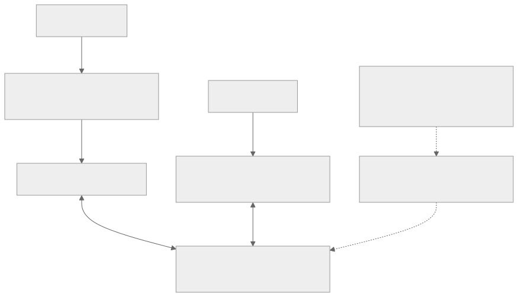

# 透過 MQTT 與 HTTP 操作裝置影子

兩種介面都可以操作同一裝置、同一名稱的影子。HTTP 需要啟用 `iot_shadow`；MQTT 需要同時啟用 `mqtt` 與 `iot_shadow`。授權規則也必須允許目前身分存取目標裝置並執行該操作。

## 兩種介面，共用同一份狀態

MQTT 與 HTTP 透過不同的驗證與回應流程，存取同一裝置、同一名稱的影子。雖然文件操作規則相同，MQTT 的傳輸確認並不等於 HTTP 或影子操作成功。兩種介面仍各自檢查服務功能是否啟用，以及呼叫者是否有權限。



[開啟完整方塊圖](assets/shadow-interface-map.zh-TW.svg) · [Mermaid 原始檔](assets/shadow-interface-map.zh-TW.mmd)

## MQTT 請求與回應

[開啟時序圖](assets/shadow-mqtt-request.zh-TW.html)

使用[裝置狀態同步快速入門](shadow-quickstart.zh-TW.md)中的 `shadow_publish` 輔助函式。請先訂閱該操作完整且明確的 accepted 與 rejected 主題。GET 可附帶 `clientToken` 來對應請求與回應；UPDATE 則傳送 JSON 部分更新。DELETE 會忽略 payload，成功時回傳空物件，因此不能依賴刪除回應帶回 `clientToken`。

若要明確刪除測試影子，請先監聽兩個刪除回應主題，再發布：

```bash
shadow_publish "$TUTORIAL_DIR/app-token.json" delete '{}'
```

刪除後再次 GET 應回傳 404。同一影子的刪除操作請依序執行，避免無法判斷回應屬於哪次請求。完整主題後綴請見[參考文件](shadow-reference.zh-TW.md)。

## 簽署 HTTP 請求

[開啟時序圖](assets/shadow-http-request.zh-TW.html)

以下 Bash 輔助函式使用 curl 的 SigV4 簽署功能。請先在申請 token 時指定 `aws_iot_data:true`。取得的驗證資訊適用於 RTK 自訂端點，不需要 AWS 帳戶的驗證資訊。

```bash
export TOKEN_FILE="$TUTORIAL_DIR/app-token.json"
export SHADOW_ENDPOINT="$(jq -er '.aws_credentials.iotDataEndpoint' "$TOKEN_FILE")"
export SHADOW_REGION="$(jq -er '.aws_credentials.region' "$TOKEN_FILE")"
export SHADOW_ACCESS_KEY="$(jq -er '.aws_credentials.accessKeyId' "$TOKEN_FILE")"
export SHADOW_SECRET_KEY="$(jq -er '.aws_credentials.secretAccessKey' "$TOKEN_FILE")"
export SHADOW_SESSION_TOKEN="$(jq -er '.aws_credentials.sessionToken' "$TOKEN_FILE")"
shadow_http() {
  curl --silent --show-error --fail-with-body --cacert "$CA_FILE" \
    --aws-sigv4 "aws:amz:$SHADOW_REGION:iotdevicegateway" \
    --user "$SHADOW_ACCESS_KEY:$SHADOW_SECRET_KEY" \
    -H "x-amz-security-token: $SHADOW_SESSION_TOKEN" "$@"
}
ENCODED_DEVICE="$(jq -rn --arg v "$DEVICE_ID" '$v|@uri')"
ENCODED_NAME="$(jq -rn --arg v "$SHADOW_NAME" '$v|@uri')"
SHADOW_URL="${SHADOW_ENDPOINT%/}/things/$ENCODED_DEVICE/shadow?name=$ENCODED_NAME"
```

請原樣使用回傳的 endpoint 與 region，並保持電腦時鐘同步。若要操作未命名影子，請省略整段 `?name=...` 查詢字串；傳入 `name=` 並不代表未命名影子。

### 讀取與更新

```bash
shadow_http "$SHADOW_URL"
shadow_http -X POST -H 'Content-Type: application/json' \
  --data-binary '{"state":{"desired":{"power":"on"}},"clientToken":"tutorial-http-on"}' \
  "$SHADOW_URL"
shadow_http "$SHADOW_URL"
```

若第一次 GET 回傳 404，POST 會建立影子。POST 成功時回傳接受的部分更新，最後的 GET 才會回傳目前完整狀態。HTTP 請求完成時，不會等待 MQTT 通知送達或裝置執行操作。請持續執行快速入門中的 MQTT 監聽程式，以觀察由 HTTP 操作觸發的 MQTT 通知。

### 列出具名影子

```bash
shadow_http "${SHADOW_ENDPOINT%/}/api/things/shadow/ListNamedShadowsForThing/$ENCODED_DEVICE?pageSize=10"
```

讀取 `results`、可能出現的 `nextToken`，以及 `timestamp`。若有 `nextToken`，請將它做 URL 編碼後，原樣帶入同一裝置的下一次請求；不要解碼或修改這個分頁游標。清單不包含未命名影子；Thing 不存在時會回傳空清單。

### 刪除教學狀態

完成這個測試影子的操作後，才執行下列命令：

```bash
shadow_http -X DELETE "$SHADOW_URL"
shadow_http "$SHADOW_URL"
```

DELETE 成功時回傳空 JSON 物件，接著 GET 會回傳 404。GET 與 DELETE 不可帶請求本文。若在刪除後 48 小時內重建，版本編號會延續原本的序列。

## 錯誤處理

請同時檢查 HTTP 狀態碼與錯誤 JSON。`--fail-with-body` 會保留錯誤本文，並讓命令以非零狀態結束。遇到 401 時，檢查驗證資訊、session token、時鐘、endpoint 與 region。遇到 409 時，重新 GET 最新狀態並計算更新內容，不要直接重送過期的部分更新。對於持續性的 4xx 錯誤，應先修正請求再重試。

下一步：[完整參考文件](shadow-reference.zh-TW.md)。
