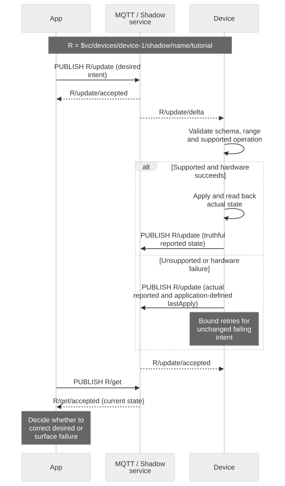

# Designing Your Device State Model

## Partition by lifecycle and responsibility

Configuration and diagnostics are illustrative application-selected names, not pre-created service resources. Split state only when ownership, cadence or lifecycle can be independent. Each Shadow has its own version and payload budget; there is no cross-Shadow transaction or name-based permission guarantee.



[Full-size block diagram](assets/shadow-partitioning.svg) · [Mermaid source](assets/shadow-partitioning.mmd)

## Goal and prerequisites

Design a state schema that firmware, App and Backend can interpret consistently. Read [Shadow concepts](shadow-concepts.en.md) and [merge rules](shadow-reference.en.md). The service stores JSON and computes differences; it does not validate your domain schema, execute hardware or translate firmware versions.

## Start with persistent intent and observed facts

Use `desired.power` for the target and `reported.power` for measured/applied state. Keep units in field names or your schema definition, for example `temperatureC` and `sampleIntervalSeconds`. Distinguish a missing property from an explicit `false`, `0` or empty string. `null` means deletion in a patch, not a lasting unknown measurement.

Example application-owned schema, not built-in service fields:

```json
{
  "state": {
    "desired": {
      "schemaVersion": 1,
      "power": "on",
      "sampleIntervalSeconds": 30
    },
    "reported": {
      "schemaVersion": 1,
      "power": "off",
      "sampleIntervalSeconds": 30,
      "firmwareVersion": "1.0.0",
      "lastApply": {
        "requestId": "intent-42",
        "status": "failed",
        "code": "ACTUATOR_UNAVAILABLE"
      }
    }
  }
}
```

`lastApply`, `requestId`, status and code are conventions you implement. They do not create server idempotency, command delivery, authorization or automatic timeout behavior. Report actual power `off` after a failed operation; do not copy desired to reported merely to clear delta. If using a request identifier, add it consistently to your intended schema and define retention and deduplication in firmware.



[Full-size diagram](assets/state-application.svg) · [Mermaid source](assets/state-application.mmd)

## Unsupported settings and execution failures

Validate type, range, allowed transitions and schema version before hardware access. Apply supported changes and read back actual state. Decide explicitly whether a multi-field configuration is all-or-nothing or permits partial application; Shadow's JSON mutation atomicity does not make hardware operations atomic.

For unsupported intent, report a compact application-defined failure and supported schema/capabilities, then stop retrying the same failing intent until it changes or a defined recovery condition occurs. Leave reported truthful. The controller can correct or remove invalid desired fields; removal uses `null`. Do not put unbounded error history in Shadow.

## Split named Shadows by independent lifecycle

Keep this tutorial's power control in `tutorial`. In a product, named Shadows such as `configuration` and `diagnostics` can separate update cadence, schema ownership and payload budget. Each has an independent version and lifecycle. There is no cross-Shadow transaction or universal event order. A name alone is not an authorization boundary; validate the actual principal policy.

Do not split fields that require one atomic JSON update merely to avoid conflict. Publish telemetry history to its supported ingestion interface rather than growing arrays indefinitely. Arrays replace atomically, so concurrent index edits are especially error-prone. Check the merged 8 KiB state limit, not only patch length.

## Multiple controllers

Two Apps should GET version N, compute their intent, then update with N. One update may succeed and the other return 409. On conflict, show current state or apply a documented merge rule; never silently force an old whole-document snapshot over a newer writer. Send the smallest intended patch. Conditional versions protect the complete Shadow, so a firmware reported update can also invalidate an App's guard.

Follow the [conflict sequence and executable reproduction](integration-recipes.en.md). The server does not provide domain ownership, user precedence or a compare-and-swap for one field independently of the document version.

## Firmware schema evolution

1. Define supported schema versions and migration rules in both controller and firmware.
2. Prefer additive optional fields; older clients should tolerate unknown fields but must not execute unknown actions.
3. Preserve existing meaning and units. A Celsius-to-Fahrenheit change needs a new field or schema version.
4. Roll out a reader that understands old and new schemas before a writer sends the new schema.
5. GET and reconcile stored desired after upgrade or rollback; do not assume firmware flashing removes cloud state.
6. Remove obsolete desired properties explicitly after compatible consumers are deployed. Keep migration idempotent and bounded.

A delete/recreate can affect version continuity; consult the [48-hour tombstone rule](shadow-reference.en.md) and establish a new baseline when lifecycle changes. Use a separate command protocol for irreversible one-time actions, not a persistent replayable desired field.

## Review checklist

For each field record owner, type, unit, range, omission/default behavior, supported schema versions, persistence and execution-failure behavior. Exercise stale writes, duplicates, unsupported fields, partial hardware failure, reboot and firmware rollback. Next: [API examples](api-examples.en.md), [recovery](credential-recovery.en.md).
