# 设计装置状态模型

## 按生命周期和责任划分

配置和诊断是应用程式选择的名称，而不是预先建立的服务资源。只有在所有权、节奏或生命周期可以独立时才分开状态。每个影子都有自己的版本和有效载荷预算；没有跨影子交易或基于名称的许可权保证。



[全尺寸方块图](assets/shadow-partitioning.zh-CN.svg) · [Mermaid 原始档](assets/shadow-partitioning.zh-CN.mmd)

## 目标和先决条件

设计一个状态模式，让韧体、应用程式和后端可以一致地解释。 阅读[影子概念](shadow-concepts.zh-CN.md)与[合并规则](shadow-reference.zh-CN.md)。该服务储存JSON并计算差异；它不会验证您的域模式，执行硬体或翻译韧体版本。

## 从持久的意图和观察到的事实开始

使用`desired.power`为了目标和`reported.power`对于测量/应用状态。将单位保留在栏位名称或您的模式定义中，例如`temperatureC`与`sampleIntervalSeconds`.区分缺少的属性和明确的`false`, `0`或空字串。`null`意味著在补丁中删除，而不是永久未知测量。

示例应用程式拥有的模式，而不是内建的服务栏位：

```json
{
  "state": {
    "desired": {
      "schemaVersion": 1,
      "power": "on",
      "sampleIntervalSeconds": 30
    },
    "reported": {
      "schemaVersion": 1,
      "power": "off",
      "sampleIntervalSeconds": 30,
      "firmwareVersion": "1.0.0",
      "lastApply": {
        "requestId": "intent-42",
        "status": "failed",
        "code": "ACTUATOR_UNAVAILABLE"
      }
    }
  }
}
```

`lastApply`, `requestId`，状态和程式是您实施的惯例。它们不会建立伺服器无效性、命令传递、授权或自动超时行为。报告实际功率`off`操作失败后；不要仅仅复制所需的内容到报告内容中，以清除差异。如果使用请求识别符号，请始终将其新增到预期的模式中，并在韧体中定义保留和重复资料删除。

[开启重新设计的序列图](assets/state-application.zh-CN.html)

## 不受支援的设定和执行失败

在访问硬体之前，请验证型别、范围、允许的过渡和模式版本。应用支援的更改并读取实际状态。明确决定多栏位配置是全有还是允许部分应用；Shadow的JSON变异原子性并不能使硬体操作原子化。

对于不受支援的意图，请报告一个应用程式定义的紧凑式失败和受支援的模式/功能，然后停止重试相同的失败意图，直到它发生变化或发生定义的恢复条件。请保持报告的真实性。控制器可以更正或移除无效的预期栏位；移除使用`null`。不要将无限制的错误历史记录放在影子中。

## 根据独立生命周期将命名的Shadows分开

将本教学的电源控制保持在`tutorial`. 在一个名为Shadows的产品中，例如`configuration`与`diagnostics`可以单独更新节奏、模式所有权和有效载荷预算。每个都有独立的版本和生命周期。没有跨影子交易或通用事件顺序。仅仅有一个名称并不是一个授权边界；请验证实际的主体策略。

不要分割需要单个原子JSON更新才能避免冲突的栏位。将远端监测历史记录释出到其支援的吞吐介面，而不是无限地增加阵列。阵列原子更新，因此并行索引编辑特别容易出错。请检查合并后的8 KiB状态限制，而不是补丁程式长度。

## 多个控制器

两个应用程式应该获取版本N，计算其意图，然后更新到N。一次更新可能成功，另一次则返回409。发生冲突时，显示当前状态或应用已记录的合并规则；切勿在无声的情况下强制将旧的整个档案快照覆盖到更新的写入器上。传送最小的预期补丁程式。条件式版本保护完整的影子，因此报告的韧体更新也可能使应用程式的保护失效。

遵循[冲突序列和可执行复制](integration-recipes.zh-CN.md)。伺服器不提供域所有权、使用者优先顺序或独立于档案版本对一个栏位进行比较和交换。

## 韧体模式演变

1. 在控制器和韧体中定义支援的模式版本和迁移规则。
2. 更喜欢可选的附加栏位；旧版本的客户端应该容忍未知栏位，但不得执行未知操作。
3. 保留现有意义和单位。摄氏度转华氏度的变化需要一个新的栏位或模式版本。
4. 在写入者传送新模式之前，部署一个能够理解新旧模式的读取器。
5. 在升级或倒退后获取和对齐储存的预期值；不要假设韧体闪烁会清除云状态。
6. 在部署相容的消费者后，明确删除过时的所需属性。保持迁移无效和受限。

删除/重新建立可能会影响版本连续性；请参阅[48小时墓碑规则](shadow-reference.zh-CN.md)当生命周期发生变化时，建立一个新基线。用单独的命令协议执行不可逆的一次性操作，而不是持久可重复的预期栏位。

## 回顾清单

对于每个栏位记录所有者，请输入型别、单位、范围、省略/预设行为、支援的模式版本、永续性和执行失败行为。执行过时的写入、重复、不受支援的栏位、部分硬体故障、重新启动和韧体倒退。下一步：[API示例](api-examples.zh-CN.md), [恢复](credential-recovery.zh-CN.md).
