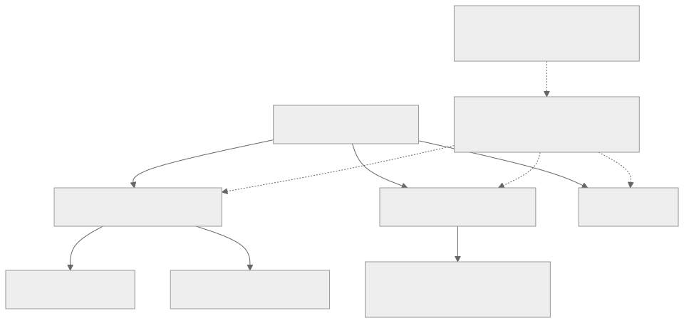

# 设计设备状态模型

## 依生命周期与责任划分

configuration 与 diagnostics 是应用程序自行选择的示例名称，不是服务预先创建的资源。只有在负责对象、更新频率或生命周期可以独立时，才拆分状态。每个影子各自管理版本与内容大小限制；系统不提供跨影子事务，也不保证能单凭名称区分访问权限。



[开启完整框图](assets/shadow-partitioning.zh-CN.svg) · [Mermaid 源文件](assets/shadow-partitioning.zh-CN.mmd)

## 目标与前置条件

设计一份让固件、应用程序与后端都能一致解读的状态结构。请先阅读[影子概念](shadow-concepts.zh-CN.md)与[合并规则](shadow-reference.zh-CN.md)。服务负责存储 JSON 并计算差异，不会验证你的业务数据结构、操作硬件，或在不同固件版本间转换数据。

## 区分持续有效的期望状态与实际观测结果

使用 `desired.power` 表示目标，使用 `reported.power` 表示测量或操作后的状态。请在字段名称或数据结构定义中明确标示单位，例如 `temperatureC` 与 `sampleIntervalSeconds`。属性缺省必须与明确的 `false`、`0` 或空字符串有所区别。在部分更新中，`null` 表示删除，不是要长期保留的「测量值未知」。

以下是应用程序自行定义的结构示例，不是服务内置字段：

```json
{
  "state": {
    "desired": {
      "schemaVersion": 1,
      "power": "on",
      "sampleIntervalSeconds": 30
    },
    "reported": {
      "schemaVersion": 1,
      "power": "off",
      "sampleIntervalSeconds": 30,
      "firmwareVersion": "1.0.0",
      "lastApply": {
        "requestId": "intent-42",
        "status": "failed",
        "code": "ACTUATOR_UNAVAILABLE"
      }
    }
  }
}
```

`lastApply`、`requestId`、status 与 code 都是你自行实现的约定。使用这些字段不会自动取得服务器端幂等性、命令传递、授权或超时机制。操作失败后，应如实上报电源仍为 `off`，不要只为消除 delta 就把 desired 复制到 reported。若使用请求识别码，请一致地纳入数据结构，并在固件中定义保留期间与去重规则。

[开启时序图](assets/state-application.zh-CN.html)

## 不支持的配置与执行失败

访问硬件前，先验证类型、范围、允许的状态转换及数据结构版本。应用支持的变更后，读回实际状态。多字段配置必须明确决定要全部成功或全部失败，还是允许部分应用；影子 JSON 更新的原子性，不代表硬件操作也有原子性。

遇到不支持的预期配置时，上报精简的应用程序错误，以及支持的数据结构或功能。接着停止重试同一笔失败配置，直到配置改变或满足指定的恢复条件。reported 必须维持真实。控制端可修正或移除无效的 desired 字段；移除时使用 `null`。不要把无上限的错误历史放进影子。

## 依独立生命周期拆分命名影子

本教学将电源控制放在 `tutorial`。在产品中，可使用 `configuration`、`diagnostics` 等命名影子，分开管理更新频率、数据结构责任与内容大小。各影子的版本与生命周期彼此独立，没有跨影子事务或全局事件顺序。名称本身不是授权边界，仍须验证实际身份的授权规则。

需要在同一次 JSON 更新中原子修改的字段，不要只为避免冲突就拆开。遥测历史应送到支持的接收接口，不要让影子内的数组无限制增长。数组以原子方式整体替换，并发修改不同索引尤其容易出错。请检查合并后的状态是否超过 8 KiB，不只检查部分更新的长度。

## 多个控制端

两个应用程序都应先 GET 取得版本 N，计算各自要变更的内容，再于更新请求中带入版本 N。其中一次更新可能成功，另一次则收到 409。发生冲突时，显示当前状态，或依已定义的合并规则处理；不可直接拿旧的完整快照覆盖较新的写入。只传送这次真正要修改的字段。版本条件保护的是整份影子，因此固件更新 reported，也可能使应用程序先前读取的版本失效。

请参考[冲突时序与可执行示例](integration-recipes.zh-CN.md)。服务器不会替应用程序决定各字段由谁负责、用户的优先顺序，也不提供独立于文档版本的单字段 compare-and-swap。

## 固件数据结构演进

1. 在控制端与固件中定义支持的数据结构版本及迁移规则。
2. 优先新增可选字段；旧客户端应容许不认识的字段，但不得执行不认识的动作。
3. 保留既有含义与单位。例如从摄氏改成华氏，必须使用新字段或新的数据结构版本。
4. 先部署能读取新旧结构的版本，再让写入方送出新结构。
5. 升级或回滚后，GET 已存储的 desired 并重新同步；不要假设重新烧录固件就会删除云端状态。
6. 兼容的读取方部署完成后，再明确移除过时的 desired 属性。迁移操作应具幂等性，且处理范围与时间有上限。

删除后重建可能影响版本延续，请查阅[48 小时删除记录保留规则](shadow-reference.zh-CN.md)，并在生命周期改变时重新创建初始基准。不可逆的一次性操作应使用独立命令协议，不要放进会持续保留、可能重复应用的 desired 字段。

## 设计检查列表

逐一记录各字段的负责对象、类型、单位、范围、缺省与默认行为、支持的结构版本、持久化方式，以及操作失败时的处理方式。测试过期写入、重复消息、不支持的字段、部分硬件失败、重启与固件回滚。下一步：[API 示例](api-examples.zh-CN.md)、[连接恢复](credential-recovery.zh-CN.md)。
