# 設計裝置狀態模型

## 按生命週期和責任劃分

配置和診斷是應用程式選擇的名稱，而不是預先建立的服務資源。只有在所有權、節奏或生命週期可以獨立時才分開狀態。每個影子都有自己的版本和有效載荷預算；沒有跨影子交易或基於名稱的許可權保證。



[全尺寸方塊圖](assets/shadow-partitioning.zh-TW.svg) · [Mermaid 原始檔](assets/shadow-partitioning.zh-TW.mmd)

## 目標和先決條件

設計一個狀態模式，讓韌體、應用程式和後端可以一致地解釋。 閱讀[影子概念](shadow-concepts.zh-TW.md)與[合併規則](shadow-reference.zh-TW.md)。該服務儲存JSON並計算差異；它不會驗證您的域模式，執行硬體或翻譯韌體版本。

## 從持久的意圖和觀察到的事實開始

使用`desired.power`為了目標和`reported.power`對於測量/應用狀態。將單位保留在欄位名稱或您的模式定義中，例如`temperatureC`與`sampleIntervalSeconds`.區分缺少的屬性和明確的`false`, `0`或空字串。`null`意味著在補丁中刪除，而不是永久未知測量。

示例應用程式擁有的模式，而不是內建的服務欄位：

```json
{
  "state": {
    "desired": {
      "schemaVersion": 1,
      "power": "on",
      "sampleIntervalSeconds": 30
    },
    "reported": {
      "schemaVersion": 1,
      "power": "off",
      "sampleIntervalSeconds": 30,
      "firmwareVersion": "1.0.0",
      "lastApply": {
        "requestId": "intent-42",
        "status": "failed",
        "code": "ACTUATOR_UNAVAILABLE"
      }
    }
  }
}
```

`lastApply`, `requestId`，狀態和程式是您實施的慣例。它們不會建立伺服器無效性、命令傳遞、授權或自動超時行為。報告實際功率`off`操作失敗後；不要僅僅複製所需的內容到報告內容中，以清除差異。如果使用請求識別符號，請始終將其新增到預期的模式中，並在韌體中定義保留和重複資料刪除。

[開啟重新設計的序列圖](assets/state-application.zh-TW.html)

## 不受支援的設定和執行失敗

在訪問硬體之前，請驗證型別、範圍、允許的過渡和模式版本。應用支援的更改並讀取實際狀態。明確決定多欄位配置是全有還是允許部分應用；Shadow的JSON變異原子性並不能使硬體操作原子化。

對於不受支援的意圖，請報告一個應用程式定義的緊湊式失敗和受支援的模式/功能，然後停止重試相同的失敗意圖，直到它發生變化或發生定義的恢復條件。請保持報告的真實性。控制器可以更正或移除無效的預期欄位；移除使用`null`。不要將無限制的錯誤歷史記錄放在影子中。

## 根據獨立生命週期將命名的Shadows分開

將本教學的電源控制保持在`tutorial`. 在一個名為Shadows的產品中，例如`configuration`與`diagnostics`可以單獨更新節奏、模式所有權和有效載荷預算。每個都有獨立的版本和生命週期。沒有跨影子交易或通用事件順序。僅僅有一個名稱並不是一個授權邊界；請驗證實際的主體策略。

不要分割需要單個原子JSON更新才能避免衝突的欄位。將遠端監測歷史記錄釋出到其支援的吞吐介面，而不是無限地增加陣列。陣列原子更新，因此並行索引編輯特別容易出錯。請檢查合併後的8 KiB狀態限制，而不是補丁程式長度。

## 多個控制器

兩個應用程式應該獲取版本N，計算其意圖，然後更新到N。一次更新可能成功，另一次則返回409。發生衝突時，顯示當前狀態或應用已記錄的合併規則；切勿在無聲的情況下強制將舊的整個檔案快照覆蓋到更新的寫入器上。傳送最小的預期補丁程式。條件式版本保護完整的影子，因此報告的韌體更新也可能使應用程式的保護失效。

遵循[衝突序列和可執行複製](integration-recipes.zh-TW.md)。伺服器不提供域所有權、使用者優先順序或獨立於檔案版本對一個欄位進行比較和交換。

## 韌體模式演變

1. 在控制器和韌體中定義支援的模式版本和遷移規則。
2. 更喜歡可選的附加欄位；舊版本的客戶端應該容忍未知欄位，但不得執行未知操作。
3. 保留現有意義和單位。攝氏度轉華氏度的變化需要一個新的欄位或模式版本。
4. 在寫入者傳送新模式之前，部署一個能夠理解新舊模式的讀取器。
5. 在升級或倒退後獲取和對齊儲存的預期值；不要假設韌體閃爍會清除雲狀態。
6. 在部署相容的消費者後，明確刪除過時的所需屬性。保持遷移無效和受限。

刪除/重新建立可能會影響版本連續性；請參閱[48小時墓碑規則](shadow-reference.zh-TW.md)當生命週期發生變化時，建立一個新基線。用單獨的命令協議執行不可逆的一次性操作，而不是持久可重複的預期欄位。

## 回顧清單

對於每個欄位記錄所有者，請輸入型別、單位、範圍、省略/預設行為、支援的模式版本、永續性和執行失敗行為。執行過時的寫入、重複、不受支援的欄位、部分硬體故障、重新啟動和韌體倒退。下一步：[API示例](api-examples.zh-TW.md), [恢復](credential-recovery.zh-TW.md).
