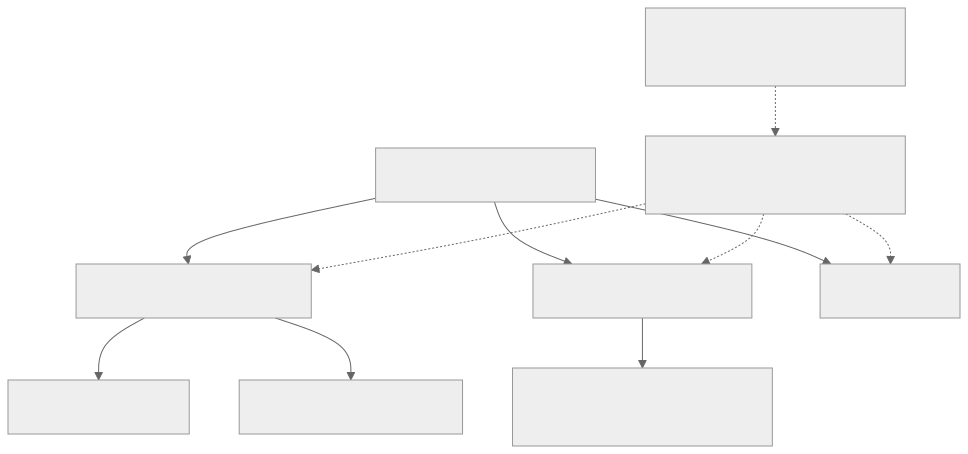

# 設計裝置狀態模型

## 依生命週期與責任劃分

configuration 與 diagnostics 是應用程式自行選擇的範例名稱，不是服務預先建立的資源。只有在負責對象、更新頻率或生命週期可以獨立時，才拆分狀態。每個影子各自管理版本與內容大小限制；系統不提供跨影子交易，也不保證能單憑名稱區分存取權限。



[開啟完整方塊圖](assets/shadow-partitioning.zh-TW.svg) · [Mermaid 原始檔](assets/shadow-partitioning.zh-TW.mmd)

## 目標與前置條件

設計一份讓韌體、應用程式與後端都能一致解讀的狀態結構。請先閱讀[影子概念](shadow-concepts.zh-TW.md)與[合併規則](shadow-reference.zh-TW.md)。服務負責儲存 JSON 並計算差異，不會驗證你的業務資料結構、操作硬體，或在不同韌體版本間轉換資料。

## 區分持續有效的預期狀態與實際觀測結果

使用 `desired.power` 表示目標，使用 `reported.power` 表示量測或操作後的狀態。請在欄位名稱或資料結構定義中明確標示單位，例如 `temperatureC` 與 `sampleIntervalSeconds`。屬性缺省必須與明確的 `false`、`0` 或空字串有所區別。在部分更新中，`null` 表示刪除，不是要長期保留的「量測值未知」。

以下是應用程式自行定義的結構範例，不是服務內建欄位：

```json
{
  "state": {
    "desired": {
      "schemaVersion": 1,
      "power": "on",
      "sampleIntervalSeconds": 30
    },
    "reported": {
      "schemaVersion": 1,
      "power": "off",
      "sampleIntervalSeconds": 30,
      "firmwareVersion": "1.0.0",
      "lastApply": {
        "requestId": "intent-42",
        "status": "failed",
        "code": "ACTUATOR_UNAVAILABLE"
      }
    }
  }
}
```

`lastApply`、`requestId`、status 與 code 都是你自行實作的約定。使用這些欄位不會自動取得伺服器端冪等性、命令傳遞、授權或逾時機制。操作失敗後，應如實回報電源仍為 `off`，不要只為消除 delta 就把 desired 複製到 reported。若使用請求識別碼，請一致地納入資料結構，並在韌體中定義保留期間與去重規則。

[開啟時序圖](assets/state-application.zh-TW.html)

## 不支援的設定與執行失敗

存取硬體前，先驗證型別、範圍、允許的狀態轉換及資料結構版本。套用支援的變更後，讀回實際狀態。多欄位設定必須明確決定要全部成功或全部失敗，還是允許部分套用；影子 JSON 更新的原子性，不代表硬體操作也有原子性。

遇到不支援的預期設定時，回報精簡的應用程式錯誤，以及支援的資料結構或功能。接著停止重試同一筆失敗設定，直到設定改變或滿足指定的恢復條件。reported 必須維持真實。控制端可修正或移除無效的 desired 欄位；移除時使用 `null`。不要把無上限的錯誤歷程放進影子。

## 依獨立生命週期拆分具名影子

本教學將電源控制放在 `tutorial`。在產品中，可使用 `configuration`、`diagnostics` 等具名影子，分開管理更新頻率、資料結構責任與內容大小。各影子的版本與生命週期彼此獨立，沒有跨影子交易或全域事件順序。名稱本身不是授權邊界，仍須驗證實際身分的授權規則。

需要在同一次 JSON 更新中原子修改的欄位，不要只為避免衝突就拆開。遙測歷程應送到支援的接收介面，不要讓影子內的陣列無限制增長。陣列以原子方式整組取代，並行修改不同索引尤其容易出錯。請檢查合併後的狀態是否超過 8 KiB，不只檢查部分更新的長度。

## 多個控制端

兩個應用程式都應先 GET 取得版本 N，計算各自要變更的內容，再於更新請求中帶入版本 N。其中一次更新可能成功，另一次則收到 409。發生衝突時，顯示目前狀態，或依已定義的合併規則處理；不可直接拿舊的完整快照覆蓋較新的寫入。只傳送這次真正要修改的欄位。版本條件保護的是整份影子，因此韌體更新 reported，也可能使應用程式先前讀取的版本失效。

請參考[衝突時序與可執行範例](integration-recipes.zh-TW.md)。伺服器不會替應用程式決定各欄位由誰負責、使用者的優先順序，也不提供獨立於文件版本的單欄位 compare-and-swap。

## 韌體資料結構演進

1. 在控制端與韌體中定義支援的資料結構版本及遷移規則。
2. 優先新增選填欄位；舊用戶端應容許不認識的欄位，但不得執行不認識的動作。
3. 保留既有含義與單位。例如從攝氏改成華氏，必須使用新欄位或新的資料結構版本。
4. 先部署能讀取新舊結構的版本，再讓寫入端送出新結構。
5. 升級或回復舊版後，GET 已儲存的 desired 並重新同步；不要假設重燒韌體就會刪除雲端狀態。
6. 相容的讀取端部署完成後，再明確移除過時的 desired 屬性。遷移操作應具冪等性，且處理範圍與時間有上限。

刪除後重建可能影響版本延續，請查閱[48 小時刪除記錄保留規則](shadow-reference.zh-TW.md)，並在生命週期改變時重新建立初始基準。不可逆的一次性操作應使用獨立命令協定，不要放進會持續保留、可能重複套用的 desired 欄位。

## 設計檢查清單

逐一記錄各欄位的負責對象、型別、單位、範圍、缺省與預設行為、支援的結構版本、持久化方式，以及操作失敗時的處理方式。測試過期寫入、重複訊息、不支援的欄位、部分硬體失敗、重新開機與韌體回復舊版。下一步：[API 範例](api-examples.zh-TW.md)、[連線恢復](credential-recovery.zh-TW.md)。
