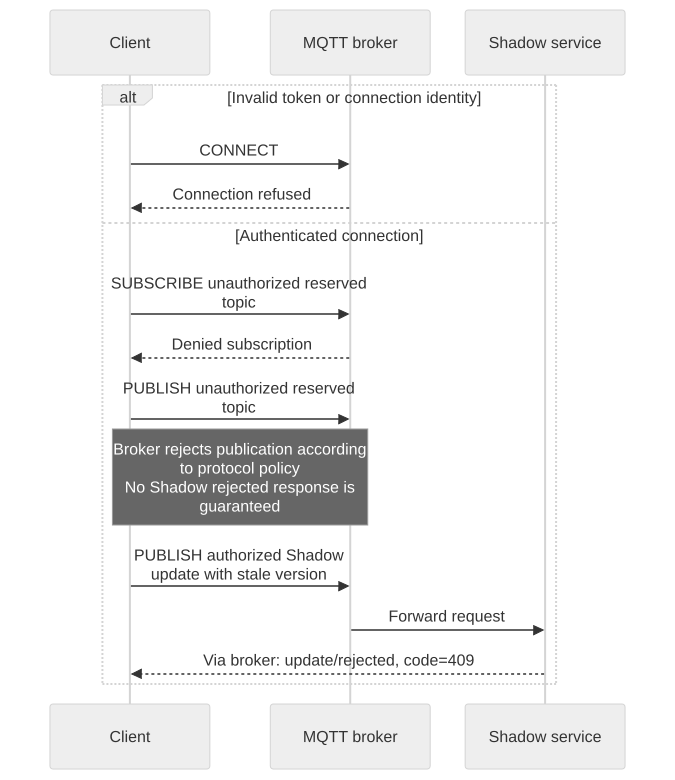

# Troubleshooting and Compatibility

Start with the first failing layer: TLS, token issuance, MQTT connection, subscription, publication, Shadow response, then device action. Success at one layer does not prove the next.

[Open full-size diagram](assets/authentication-failures.svg) · [Mermaid source](assets/authentication-failures.mmd)

## Symptom checklist

| Symptom | Check and next action |
| --- | --- |
| TLS handshake fails | Endpoint hostname, CA bundle, clock, certificate validity, matching private key |
| Token request rejected | Requested scope, certificate-derived device ID, active device, app authorization, capabilities |
| MQTT CONNECT refused | Returned username and base Client ID, permitted role suffix, current access token, `mqtt` capability |
| One connection repeatedly disconnects | Another process may be using the same Client ID |
| SUBSCRIBE denied | Use exact granted topics; broad Shadow wildcards and another device's reserved topics are not equivalent |
| General topic works, Shadow fails | Verify `iot_shadow` independently and confirm target/principal permissions |
| Publish succeeds, no Shadow reply | Verify SUBACK before request, exact response topics, pending request token and application timeout |
| Shadow GET returns 404 | Activation does not create state; first valid UPDATE does |
| No delta after desired update | GET current state; requested properties may already match reported state |
| Device never changes state | An accepted Shadow patch does not execute hardware; inspect firmware processing |
| HTTP signature rejected | Use returned endpoint/region, service `iotdevicegateway`, session token, current credentials and clock |
| 409 | GET current version and reconcile; do not resend the stale version unchanged |
| Repeated notifications | At-least-once delivery permits duplicates; deduplicate without losing same-version event types |
| 429 or slow responses | Bound concurrency, reduce rate, and back off; request deployment limits |

For support, record UTC time, operation, protocol, status/error code, clientToken, device/Shadow identifier where permitted, and SDK/client version. Exclude raw tokens, credential bundles, private keys, and sensitive application payloads.

## Compatibility boundaries

RTK Shadow follows the AWS-style document, merge, delta, version, and HTTP data-plane model. RTK MQTT uses `$vc/devices/{devid}/shadow/...`. `$aws/things/...` is not an alias. AWS Device SDK MQTT topic builders need adaptation to `$vc`; AWS service SDKs use the custom HTTP endpoint with the returned SigV4 credentials.

`thingName` is RTK `devid`. Named and unnamed Shadows are independent. Do not use old `/api/devices/{devid}/shadow` routes, infer credentials from topic strings, or insert internal tenant prefixes. Do not assume the document model itself restricts devices to reported and apps to desired; policy defines permissions.

## Qualification status

This edition is tied to the source snapshots in page metadata. Local protocol tests and diagram checks are recorded in the maintainer validation report. Production connection limits, broker policy, and entitlement enforcement must be qualified against your target environment; this edition does not certify a deployment. API behavior, credentials, or permissions should not be changed to make an example pass.

Return to [the overview](overview.en.md), [MQTT Quickstart](mqtt-quickstart.en.md), or [Shadow Quickstart](shadow-quickstart.en.md).

Continue: [Step-by-step integration debugging](debugging.en.md).
